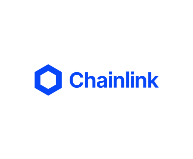
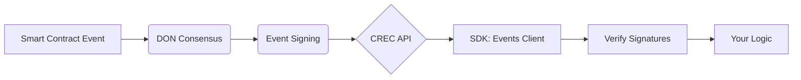
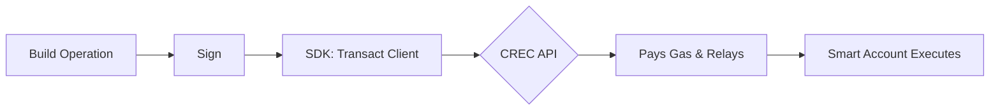

<div align="center">
  
</div>

# CRE Connect SDK

Build the next generation of verifiable applications with secure, blockchain-agnostic event processing and transaction execution — powered by the Chainlink Runtime Environment and Verifiable Network.

## What problem does CRE Connect SDK solve?

Building reliable blockchain applications requires handling:

**Event Verification Challenges:**

- Ensuring events from the blockchain are authentic and haven't been tampered with
- Decoding complex event data from various smart contracts
- Managing multiple signature verification schemes for trust

**Transaction Execution Complexities:**

- Batching multiple transactions atomically without gas estimation headaches
- Supporting various signature algorithms beyond traditional ECDSA
- Abstracting away account management while maintaining security

## How CRE Connect SDK solves it

CRE Connect SDK is a client library for the Chainlink Runtime Environment (CRE), designed to facilitate the development of applications that interact with onchain data and services.

- **Receiving verifiable events** from the blockchain with high assurance of authenticity
- **Sending operations** to the blockchain using account abstraction with gas sponsorship

## Key Features

- **🔐 Cryptographically Secure**: Multi-signature verification ensures event authenticity
- **⛽ Account Abstraction**: Batch transactions, gas sponsorship, and multiple signature support
- **🛠️ Developer-Friendly**: Rich helper services for common blockchain operations
- **🧱 Modular Design**: Use individual components or combine them for complex use cases

## Quick Start

### Prerequisites

- **Go 1.24 or higher** - Check with `go version`
- **Basic Go and blockchain knowledge**

### Installation

```bash
go get github.com/smartcontractkit/crec-sdk
```

### Initialize the Client

```go
import "github.com/smartcontractkit/crec-sdk"

client, err := crec.NewClient(
    "https://api.crec.chainlink.com",
    "your-api-key",
)
```

Event verification is enabled by default using the production DON public keys. See [Event Verification Keys](#event-verification-keys-mainnet) for details.

The unified client provides access to all sub-clients:

```go
client.Channels   // Channel CRUD operations
client.Events     // Event polling and verification
client.Transact   // Operation signing and sending
client.Wallets    // Smart wallet management
client.Watchers   // Watcher CRUD operations
```

### Using Individual Sub-Clients

If you only need a subset of the SDK's functionality, create individual sub-clients using `NewAPIClient`:

```go
import (
    "github.com/smartcontractkit/crec-sdk"
    "github.com/smartcontractkit/crec-sdk/channels"
    "github.com/smartcontractkit/crec-sdk/watchers"
)

// Create an authenticated API client
api, err := crec.NewAPIClient(
    "https://api.crec.chainlink.com",
    "your-api-key",
)

// Create only the sub-clients you need
channelsClient, _ := channels.NewClient(&channels.Options{APIClient: api})
watchersClient, _ := watchers.NewClient(&watchers.Options{
    APIClient:    api,
    PollInterval: 5 * time.Second,
})
```

## Core Workflows

### 🔍 Receiving and Verifying Events



**Poll and verify events:**

```go
// Poll events from a channel
events, hasMore, _ := client.Events.Poll(ctx, channelID, nil)

for _, event := range events {
    // CRITICAL: Always verify before processing
    verified, _ := client.Events.Verify(&event)
    if verified {
        var decoded map[string]interface{}
        client.Events.Decode(&event, &decoded)
        processEvent(decoded)
    }
}
```

### ⚡ Sending Signed Operations (Gas-less)



**Build and execute an operation:**

```go
import (
    "github.com/smartcontractkit/crec-sdk/transact/signer/local"
    "github.com/smartcontractkit/crec-sdk/transact/types"
)

// Build the operation
operation := &types.Operation{
    ID:      big.NewInt(time.Now().Unix()),
    Account: accountAddress,
    Transactions: []types.Transaction{
        {To: target, Value: big.NewInt(0), Data: calldata},
    },
}

// Create signer and execute
signer := local.NewSigner(privateKey)
result, _ := client.Transact.ExecuteOperation(ctx, channelID, signer, operation, chainSelector)
```

## Documentation

### API Reference

For complete API documentation, use Go's built-in documentation tools:

```bash
go doc github.com/smartcontractkit/crec-sdk
go doc github.com/smartcontractkit/crec-sdk/channels
go doc github.com/smartcontractkit/crec-sdk/events
go doc github.com/smartcontractkit/crec-sdk/transact
go doc github.com/smartcontractkit/crec-sdk/wallets
go doc github.com/smartcontractkit/crec-sdk/watchers
```

Or run a local documentation server:

```bash
go install golang.org/x/pkgsite/cmd/pkgsite@latest
pkgsite -http :8080
# Navigate to http://localhost:8080/github.com/smartcontractkit/crec-sdk
```

### Complete Example

See the [crec-example-payment-processor](https://github.com/smartcontractkit/crec-example-payment-processor) repository for a full working application.

## Extensions

Protocol-specific helpers for common Chainlink systems:

- [crec-sdk-ext-ccip](https://github.com/smartcontractkit/crec-sdk-ext-ccip) - Cross-Chain Interoperability Protocol
- [crec-sdk-ext-dvp](https://github.com/smartcontractkit/crec-sdk-ext-dvp) - Delivery versus Payment
- [crec-sdk-ext-dta](https://github.com/smartcontractkit/crec-sdk-ext-dta) - Digital Transfer Agent

## Related

- [crec-workflow-utils](https://github.com/smartcontractkit/crec-workflow-utils) - Shared utilities for event-listener workflows
- [crec-sdk-ext-template](https://github.com/smartcontractkit/crec-sdk-ext-template) - Code generator for building CREC SDK extensions

## Event Verification Keys (Mainnet)

The SDK includes built-in mainnet DON public keys for event verification. **No configuration is required** — verification is enabled by default.

### Default Configuration

- **Keys**: All Zone A workflow nodes (10 keys)
- **Required Signatures**: 3 (configurable)

## DON Keys Reference

### ethereum-mainnet

#### zone-a

| Node Operator                    | Public Key                                   |
| -------------------------------- | -------------------------------------------- |
| chainlayer-wf-zone-a-1           | `0xff9b062fccb2f042311343048b9518068370f837` |
| clp-cre-wf-zone-a-0              | `0xe55fcaf921e76c6bbcf9415bba12b1236f07b0c3` |
| dextrac-wf-zone-a-3              | `0x4d6cfd44f94408a39fb1af94a53c107a730ba161` |
| fiews-wf-zone-a-2                | `0xde5cd1dd4300a0b4854f8223add60d20e1dfe21b` |
| inotel-wf-zone-a-4               | `0xf3baa9a99b5ad64f50779f449bac83baac8bfdb6` |
| linkforest-wf-zone-a-5           | `0xd7f22fb5382ff477d2ff5c702cab0ef8abf18233` |
| linkpool-wf-zone-a-0             | `0xcdf20f8ffd41b02c680988b20e68735cc8c1ca17` |
| linkriver-wf-zone-a-6            | `0x4d7d71c7e584cfa1f5c06275e5d283b9d3176924` |
| piertwo-wf-zone-a-7              | `0x1a89c98e75983ec384ad8e83eaf7d0176eeaf155` |
| simplyvc-wf-zone-a-8             | `0x4f99b550623e77b807df7cbed9c79d55e1163b48` |

### Customizing Verification

Override the defaults if you need custom keys or signature requirements:

```go
// Use custom keys and signature threshold
client, err := crec.NewClient(
    "https://api.crec.chainlink.com",
    "your-api-key",
    crec.WithEventVerification(5, []string{  // Require 5 signatures
        "0xff9b062fccb2f042311343048b9518068370f837",
        "0xe55fcaf921e76c6bbcf9415bba12b1236f07b0c3",
        // ... custom key list ...
    }),
)

// Or disable verification entirely
client, err := crec.NewClient(
    "https://api.crec.chainlink.com",
    "your-api-key",
    crec.WithoutEventVerification(),
)
```

> **Note**: Keys rarely change. When they do, update the SDK to get the latest defaults.

## Glossary

| Term                    | Description                                                                             |
| ----------------------- | --------------------------------------------------------------------------------------- |
| **CREC**                | CRE Connect - decentralized network providing cryptographic proof of event authenticity |
| **DON**                 | Decentralized Oracle Network - independent nodes that reach consensus and sign events   |
| **Verifiable Event**    | Blockchain event with cryptographic signatures from DON members                         |
| **Account Abstraction** | Transaction model with atomic execution, gas sponsorship, and flexible signing          |
| **Operation**           | Bundle of transactions executed atomically by a smart account                           |
| **EIP-712**             | Ethereum standard for typed data signing, used for operation signatures                 |
| **CCIP**                | Cross-Chain Interoperability Protocol for cross-chain transfers                         |

## License

[MIT](LICENSE.md)
