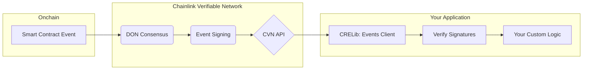
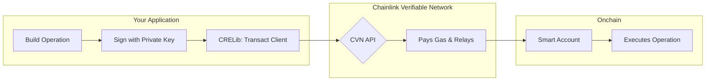

<div align="center">
  
</div>

# Chainlink Runtime Environment Client Library (CRELib)

Build the next generation of verifiable applications with secure, blockchain-agnostic event processing and transaction execution — powered by the Chainlink Runtime Environment and Verifiable Network.

## What problem does CRELib solve?

Building reliable blockchain applications requires handling:

**Event Verification Challenges:**

- Ensuring events from the blockchain are authentic and haven't been tampered with
- Decoding complex event data from various smart contracts
- Managing multiple signature verification schemes for trust

**Transaction Execution Complexities:**

- Batching multiple transactions atomically without gas estimation headaches
- Supporting various signature algorithms beyond traditional ECDSA
- Abstracting away account management while maintaining security

## How CRELib solves it: An overview

CRELib is a client library for the Chainlink Runtime Environment (CRE), designed to facilitate the development of applications that interact with onchain data and services.

The CRELib integrates with the following capabilities of the Chainlink Verifiable Network:

- **Receiving verifiable events** from the blockchain with high assurance of the event's authenticity. Events can come from well-known services where they are decoded and decorated with extensive metadata, or they can be received from any smart contract, with decoding handled by the application.
- **Sending operations** to the blockchain using an account abstraction model. This allows an operation to contain a batch of transactions, have gas sponsorship, and use a wider variety of signature algorithms.

The library also includes a number of [helper services](#services-helpers-for-common-protocols) to simplify interaction with specific Chainlink onchain systems.

## Key Features

- **🔐 Cryptographically Secure**: Multi-signature verification ensures event authenticity
- **⛽ Account Abstraction**: Batch transactions, gas sponsorship, and support for multiple signatures
- **🛠️ Developer-Friendly**: Rich, helper services for common blockchain operations
- **🧱 Modular Design**: Use individual components, combine, or extend them for complex use cases

## What's in this README

**Quick start:**

- [Installation & basic examples](#example-usage) - Get up and running in minutes
- [Complete example application](#complete-example-application) - See CRELib in action with a demo payment processor

**For specific use cases:**

- [DvP service](#dvp-service) - Asset and payment exchange
- [CCIP service](#ccip-service) - Cross-chain token transfers

**Deep dive:**

- [Core concepts](#core-concepts) - Understand the fundamentals
- [Core workflows](#core-workflows) - Architecture and data flow
- [Full API reference](#full-api-reference--documentation) - Complete documentation

## Core concepts

Before diving into the workflows, let's understand the key concepts:

### Chainlink Verifiable Network (CVN)

The CVN is a decentralized network that provides cryptographic proof of event authenticity through consensus among Decentralized Oracle Network (DON) members.

### Verifiable Events

Events from the blockchain that include cryptographic signatures from multiple DON members, allowing applications to verify their authenticity without trusting a single source. See the [`events` package](./events) for implementation details.

### Account Abstraction

A transaction model where operations can contain multiple transactions executed atomically by a smart account, with gas fees sponsored by the network and support for various signature algorithms. See the [`transact` package](./transact) for implementation details.

### DON (Decentralized Oracle Network)

A network of independent nodes that reach consensus on event authenticity and collectively sign verifiable events.

## Core workflows

CRELib is built around two primary workflows that map directly to the core capabilities of the Chainlink Verifiable Network: **listening for verifiable events** and **sending signed operations**.

### Workflow 1: Listening for verifiable events

This workflow allows your application to securely react to onchain events. Instead of trusting a single source, CRELib leverages Chainlink's decentralized network to achieve consensus that an event truly happened.

**Here's how the verification process works:**



1. **Event Occurs:** A relevant event is emitted by a smart contract on the blockchain.
2. **Consensus & Signing:** A Decentralized Oracle Network (DON) observes the event, comes to a consensus, and collectively signs it.
3. **Fetch & Verify:** The `events` client fetches this signed event from the CVN API. It then cryptographically verifies that the signatures are authentic and from the trusted DON members.
4. **Trigger Your Logic:** Once verified, you can confidently use the event data to trigger your application's logic. For example, upon receiving a verified `PaymentReceived` event, an e-commerce platform could check its internal database and then use the `transact` client to trigger the on-chain delivery of the purchased digital asset.

### Workflow 2: Sending signed operations (gas-less)

This workflow allows your application to execute onchain actions on behalf of your users, without requiring them to hold tokens for gas fees. It uses an account abstraction model where the user signs an _intent_ (the operation), and the network takes care of the execution and gas costs.

**Here's how gasless transaction execution works:**



1. **Build & Sign:** Your application constructs an `Operation`, which is a list of one or more transactions to be executed atomically. You then use the `transact` client to sign this operation with a user's private key.
2. **Send to CVN:** The library sends the signed operation to the CVN API.
3. **Relay & Execute:** The Chainlink network takes the operation, pays the necessary gas fees, and relays it to a designated onchain smart account for execution.
4. **Operation Executed:** The smart account verifies the signature on the operation and executes the bundled transactions.

## Example usage

Before diving into the examples, here's what you need to get started.

**Note**: For a complete working example, see the [example payment processor application](https://github.com/smartcontractkit/cvn-example-payment-processor).

### Prerequisites

- **Go 1.24 or higher** - Check your version with `go version`. If you need to upgrade, see [the Go installation guide](https://go.dev/doc/install).
- **Basic Go programming knowledge** - Familiarity with Go syntax, structs, interfaces, and error handling
- **Basic blockchain knowledge** - Understanding of transactions, events, and smart contracts

### Installation

Install CRELib by running the following `go get` command in your terminal:

```bash
go get github.com/smartcontractkit/cvn-sdk
```

### Usage guides

These guides walk through the most common use cases for CRELib.

### 🔍 Receiving and verifying events

This guide shows you how to use the `events` client to fetch, verify, and decode verifiable events from the CVN.

#### Step 1: Initialize the `events` client

First, you need an `events.Client`. This requires an existing `client.CVNClient` and a set of `ClientOptions`. The options are critical for defining your security parameters.

```go
import (
    "context"
    "fmt"

    "github.com/smartcontractkit/cvn-sdk/client"
    "github.com/smartcontractkit/cvn-sdk/events"
)

// create a CVN client pointed to the Chainlink Verifiable Network URL
cvnClient, _ := client.NewCVNClient(cvnURL)

// Create CVN events client with trusted signers
cvnEventsClient, _ := events.NewClient(
    cvnClient,
    &events.ClientOptions{
        MinRequiredSignatures: 3,

        // A list of the public addresses of the trusted DON members
        // who are authorized to sign events.
        ValidSigners: []string{
            "0x5db070ceabcf97e45d96b4f951a1df050ddb5559",
            "0xadebb9657c04692275973230b06adfabacc899bc",
            "0xc868bbb5d93e97b9d780fc93811a00ca7c016751",
            "0x1804f720c6c42b8075d03f3ddda8bd3cf49960de",
            "0xf191da826a7757ea2e3a8a5e147ddb378d6d0efe",
        },
    },
)
```

#### Step 2: Get events from the CVN

Use the `GetEvents` method to fetch a list of recent events. The client automatically tracks the last event you read, so you won't get duplicates on subsequent calls.

```go
// Get a list of events from the CVN
eventList, _ := cvnEventsClient.GetEvents(context.Background())
```

#### Step 3: Loop, verify, and decode

For each event in the list, you must perform two crucial actions:

1.  **Verify():** This is the most important step. It checks the event's signatures against your list of `ValidSigners`. If the number of valid signatures meets your `MinRequiredSignatures`, the event is considered authentic. **Never skip this step.**
2.  **Decode():** Once verified, this method unpacks the event's data into a Go struct you define, making it easy to work with.

```go
for _, event := range *eventList {
    // Verify the event's authenticity and integrity
    verified, _ := cvnEventsClient.Verify(event)
    if verified {
        // Decode the event into a structured format
        var decodedEvent map[string]interface{}
        cvnEventsClient.Decode(event, &decodedEvent)

        handle(decodedEvent) // Handle the decoded event
    } else {
        fmt.Println("Event verification failed")
    }
}
```

### ⚡ Sending a signed operation

This guide shows you how to use the `transact` client to build an operation, sign it with a local private key, and send it to the CVN for gas-sponsored execution.

#### Step 1: Initialize the `transact` client

First, create a `transact.Client`. It needs a `client.CVNClient` and the `ChainId` for the network where the operation will be executed.

```go
import (
    "context"
    "math/big"
    "time"

    "github.com/smartcontractkit/cvn-sdk/client"
    "github.com/smartcontractkit/cvn-sdk/transact"
    "github.com/smartcontractkit/cvn-sdk/transact/signer"
    transactTypes "github.com/smartcontractkit/cvn-sdk/transact/types"
)

// create a CVN client pointed to the Chainlink Verifiable Network URL
cvnClient, _ := client.NewCVNClient(cvnURL)

// Create CVN transact client
cvnTransactClient, _ = transact.NewClient(
    cvnClient,
    &transact.ClientOptions{
        ChainId: "1337", // The ID of the target blockchain
    },
)
```

#### Step 2: Build the `operation`

An `Operation` is a wrapper around one or more transactions that you want to execute atomically.

- **ID:** A unique identifier to prevent replay attacks. A simple timestamp is often sufficient.
- **Account:** The onchain smart account address that will execute this operation.
- **Transactions:** A slice of one or more transactions. Each includes the target contract (`To`), the `Value` of native currency to send, and the encoded `Data` for the function call.

```go
// Create a transaction to call a smart contract function
operation := &transactTypes.Operation{
    ID: big.NewInt(time.Now().Unix()), // unique ID for the operation to prevent replay attacks
    Account: accountAddress, // address of the smart account that will perform the operation
    Transactions: []*transactTypes.Transaction { // list of transactions to be executed atomically by the smart account
        {
            To:    target, // address of the contract to call
            Value: big.NewInt(0),
            Data:  calldata, // encoded calldata for the contract call
        },
    },
}
```

#### Step 3: Create a signer and sign the `operation`

The library uses a `Signer` interface to sign operations. The `NewLocalSigner` implementation handles signing with a standard ECDSA private key. The `SignOperation` method computes the EIP-712 hash of the operation and signs it.

```go
// Create a local signer with the private key of an address authorized to sign the operation in the smart account
operationSigner = signer.NewLocalSigner(privateKey)

// Sign the operation using the local signer
signature, _ := cvnTransactClient.SignOperation(operation, operationSigner)
```

#### Step 4: Send the signed `operation`

Finally, send the `operation` and its `signature` to the CVN. The network will validate the request, pay the gas fee, and relay it to the blockchain for execution.

```go
// Send the signed operation to the Chainlink Verifiable Network for relaying onchain
cvnTransactClient.SendSignedOperation(context.Background(), operation, signature)
```

#### 🔑 Signing

The signing of operations is performed by various implementations of the `Signer` interface. Currently, the library supports signing using a local ECDSA private key, but additional signing methods will be added in the future.

The `NewLocalSigner` implementation handles signing with a standard ECDSA private key, and the `SignOperation` method computes the EIP-712 hash of the operation and signs it with cryptographic precision.

## Library reference

### Packages

The following packages are available in CRELib:

- [`client`](./client): The main client package for interacting with the Chainlink Verifiable Network.
- [`events`](./events): Provides functionality for receiving and decoding verifiable events from the Chainlink Verifiable Network.
- [`transact`](./transact): Provides functionality for sending onchain operations using the account abstraction model.
- [`services`](./services): Helper services that simplify interaction with specific Chainlink systems. The following services are available:
  - [`services/dvp`](./services/dvp): Provides the DvP (Delivery vs Payment) service for asset and payment exchange.
  - [`services/ccip`](./services/ccip): Provides the CCIP (Cross Chain Interoperability Protocol) service for cross-chain token transfers and messaging.

### Services: Helpers for common protocols

CRELib includes helper services to simplify interaction with specific Chainlink systems. These packages wrap the generic `events` and `transact` clients to
provide a more straightforward API for common use cases.

#### DvP service

The DvP (Delivery vs. Payment) service allows for the secure and trustless transfer of assets between parties. The helper service supports:

- Proposing a settlement as the seller of an asset token.
- Accepting a settlement as the buyer of an asset token.
- Executing a settlement as a designated third party (e.g., an offchain payment network).
- Optionally including token approval/hold transactions in the settlement operations.

For more details, see the [DVP Service README](./services/dvp/README.md).

#### CCIP service

The CCIP (Cross-Chain Interoperability Protocol) service allows for transferring tokens and sending messages between different blockchains. The helper can optionally
include the necessary token approvals for the assets attached to the CCIP message.

For implementation details, see the [CCIP service package](./services/ccip).

### Full API reference & documentation

To view the complete code documentation for every function and type, you can run a local documentation server.

1. **Install `pkgsite`:**
   ```bash
   go install golang.org/x/pkgsite/cmd/pkgsite@latest
   ```
2. **Run the server:** You can either add the Go bin directory to your shell's PATH or run `pkgsite` using its full path.

   **Option A (Recommended): Add Go bin to your PATH**

   ```bash
   export PATH=$PATH:$(go env GOPATH)/bin
   pkgsite -http :8080
   ```

   **Option B: Run with the full path**

   ```bash
   $(go env GOPATH)/bin/pkgsite -http :8080
   ```

3. **Navigate** to `http://localhost:8080` in your browser.

   You can then explore the documentation for each package:

   - [client](http://localhost:8080/pkg/github.com/smartcontractkit/cvn-sdk/client/) - Main CVN client
   - [events](http://localhost:8080/pkg/github.com/smartcontractkit/cvn-sdk/events/) - Event processing
   - [transact](http://localhost:8080/pkg/github.com/smartcontractkit/cvn-sdk/transact/) - Transaction operations
   - [services/dvp](http://localhost:8080/pkg/github.com/smartcontractkit/cvn-sdk/services/dvp/) - DvP service
   - [services/ccip](http://localhost:8080/pkg/github.com/smartcontractkit/cvn-sdk/services/ccip/) - CCIP service

### Complete example application

An example application using CRELib can be found in the [cvn-example-payment-processor](https://github.com/smartcontractkit/cvn-example-payment-processor) repository.

## Glossary

### Core terms

**CVN (Chainlink Verifiable Network)**: A decentralized network that provides cryptographic proof of blockchain event authenticity through consensus among DON members.

**DON (Decentralized Oracle Network)**: A network of independent nodes that observe blockchain events, reach consensus, and collectively sign verifiable events.

**OCR (Off-Chain Reporting)**: The protocol used by DON members to aggregate data and generate consensus reports with cryptographic signatures.

**Verifiable Event**: A blockchain event that includes cryptographic signatures from multiple DON members, allowing applications to verify authenticity without trusting a single source.

**Account Abstraction**: A transaction model where operations can contain multiple transactions executed atomically by a smart account, with gas fees sponsored by the network.

### Technical terms

**EIP-712**: Ethereum standard for typed structured data hashing and signing, used for operation signatures in CRELib.

**Operation**: A wrapper containing one or more transactions to be executed atomically by a smart account.

**Smart Account**: An onchain account that can execute operations after verifying signatures and permissions.

**Hold Manager**: A smart contract system for creating token holds/escrows, particularly for ERC3643 tokens. See the [Hold Manager Go bindings](./interfaces/holdmanager) for available methods.

**Settlement**: In the DvP service, an atomic exchange of assets between parties with cryptographic guarantees.

**CCIP**: Cross-Chain Interoperability Protocol for transferring tokens and messages between different blockchains.
