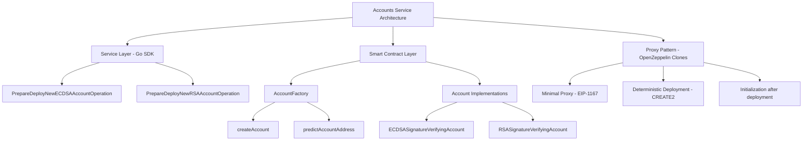
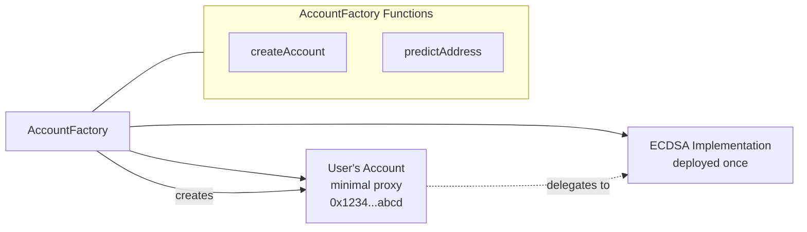

# Accounts Service

The Accounts Service provides a comprehensive Go SDK for provisioning and deploying smart wallet accounts on the CVN platform. This service enables users to create deterministic, signature-verifying account contracts that serve as the foundation for executing CVN business operations like DvP settlements and DTA transactions.

## Table of Contents

-   [Overview](#overview)
-   [Architecture](#architecture)
-   [Smart Contract Foundation](#smart-contract-foundation)
-   [Service Configuration](#service-configuration)
-   [Account Types](#account-types)
-   [Operation Preparation](#operation-preparation)
-   [Contract Integration](#contract-integration)

## Overview

The Accounts Service is a **provisioning service** that creates smart wallet accounts for CVN users. This service focuses on the **infrastructure layer** - deploying the account contracts that users need to participate in CVN operations.

Think of it as the **"wallet factory"** that creates the secure, signature-verifying contracts that CVN users control. Once deployed, these accounts become the execution layer for all CVN business operations.

### Key Benefits

-   ✅ **Deterministic Deployment** using OpenZeppelin's Clone Factory pattern
-   ✅ **Multiple Signature Types** supporting both ECDSA and RSA verification
-   ✅ **Gas Efficient** using minimal proxy clones (EIP-1167)
-   ✅ **Keystone Integration** for decentralized oracle reporting
-   ✅ **Type-Safe Operations** with comprehensive ABI encoding
-   ✅ **Predictable Addresses** for account address calculation before deployment

## Architecture



## Smart Contract Foundation

The Accounts Service leverages **OpenZeppelin's Clone Factory pattern** to create gas-efficient, deterministic account deployments. This architecture separates **implementation contracts** from **proxy contracts**, enabling cost-effective scaling.

### The Clone Factory Pattern

Instead of deploying full contract bytecode for each account (expensive), the system:

1. **Deploys implementation contracts once** (ECDSAAccount, RSAAccount, etc.)
2. **Creates minimal proxies** (EIP-1167) that delegate calls to implementations
3. **Uses deterministic salts** to ensure predictable addresses
4. **Initializes after deployment** with user-specific configuration



### AccountFactory Contract

The `AccountFactory` is the central deployment contract that:

**Core Functions:**

-   `createAccount()` - Deploys new account proxies with deterministic addresses
-   `predictAccountAddress()` - Calculates account addresses before deployment
-   `getSalt()` - Generates deterministic salts from creator + accountId

**Key Features:**

-   **Deterministic Addresses**: Uses CREATE2 with `keccak256(creator, accountId)` salt
-   **Duplicate Prevention**: Reverts if account already exists at predicted address
-   **Automatic Initialization**: Calls `initialize()` on deployed proxy immediately
-   **Gas Efficiency**: Minimal proxy deployment ~45k gas vs ~500k+ for full contracts

### Abstract Account Base Class

All account implementations inherit from the `Account` abstract contract, providing:

**Common Functionality:**

-   **EIP-712 Domain Setup** for typed data signing
-   **Keystone Forwarder Integration** for oracle reporting
-   **Owner Management** using OpenZeppelin's upgradeable ownership
-   **Template Method Pattern** for implementation-specific configuration

**Initialization Flow:**

```solidity
function initialize(
    address keystoneForwarder,  // CRE Keystone Forwarder contract
    address initialOwner,       // Account owner
    bytes calldata configParams // Implementation-specific signers
) public initializer
```

**Configuration Pattern:**
The base class uses the **template method pattern** where concrete implementations override `_configure()` to handle their specific signer encoding (ECDSA addresses vs RSA key pairs).

## Service Configuration

### ServiceOptions

Configure the accounts service with all required contract addresses:

**Configuration Details:**

-   **KeystoneForwarder**: The CVN oracle system that will call `onReport()` on deployed accounts
-   **AccountFactory**: The factory contract that creates minimal proxy clones
-   **Implementation Addresses**: Pre-deployed implementation contracts for each signature type

-   **Cross-chain Consistency**: Same account ID on different chains (if desired)

## Operation Preparation

The service provides two main operations for account deployment:

### PrepareDeployNewECDSAAccountOperation

Creates a deployment operation for ECDSA-based signature verification.

**Parameters:**

-   `accountOwnerAddress`: The Ethereum address that will own the deployed account contract
-   `allowedSigners`: Array of Ethereum addresses authorized to sign transactions for this account
-   `accountId`: Human-readable unique identifier (combined with creator to ensure uniqueness)

### PrepareDeployNewRSAAccountOperation

Creates a deployment operation for RSA-based signature verification.

**Parameters:**

-   `accountOwnerAddress`: The Ethereum address that will own the deployed account contract
-   `allowedSigners`: Array of RSA public keys (E and N components as hex strings)
-   `accountId`: Human-readable unique identifier (combined with creator to ensure uniqueness)

### Common Operation Flow

Both operations follow the same internal flow:

1. **Validate Parameters**: Check addresses and signer data format
2. **Encode Signers**: ABI-encode signer data according to account type
3. **Generate Calldata**: Create `createAccount()` function call with parameters
4. **Return Operation**: Package transaction for execution framework

## Contract Integration

### AccountFactory Integration

The service integrates with the AccountFactory contract through these key interactions:

**createAccount Function Signature:**

```solidity
function createAccount(
    address implementation,        // Implementation contract address
    bytes32 uniqueAccountId,      // Keccak256 hash of account ID string
    address keystoneForwarder,    // CVN oracle forwarder address
    address initialOwner,         // Account owner address
    bytes calldata configData     // ABI-encoded signer configuration
) external returns (address accountAddress)
```

**Parameter Mapping:**

-   `implementation`: Selected based on account type (ECDSA vs RSA)
-   `uniqueAccountId`: `crypto.Keccak256Hash([]byte(accountId))`
-   `keystoneForwarder`: From service configuration
-   `initialOwner`: `common.HexToAddress(accountOwnerAddress)`
-   `configData`: ABI-encoded signer data (address[] or (bytes,bytes)[])

### Deterministic Addresses

Accounts are deployed with deterministic addresses using CREATE2:

```solidity
// Salt generation
bytes32 salt = keccak256(abi.encodePacked(msg.sender, uniqueAccountId));

// Address prediction
address predicted = Clones.predictDeterministicAddress(implementation, salt);
```

This enables:

-   **Pre-deployment Address Calculation**: Know account address before deployment
-   **Duplicate Prevention**: Same creator + accountId always produces same address
-   **Cross-chain Consistency**: Same account ID on different chains (if desired)
