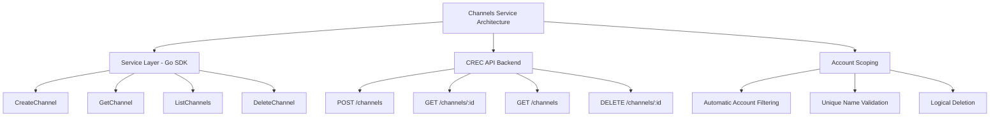

# Channels Service

The Channels Service provides a comprehensive Go SDK for managing channels in the CREC platform. Channels are logical groupings that allow you to organize your watchers, events, and operations. Each channel is associated with your account and provides isolation and structure for blockchain monitoring and transaction workflows.

## Table of Contents

- [Overview](#overview)
- [Architecture](#architecture)
- [Service Configuration](#service-configuration)
- [Channel Operations](#channel-operations)
- [Usage Examples](#usage-examples)
- [Error Handling](#error-handling)

## Overview

The Channels Service is a **structuring service** that helps organize your CREC resources. Channels act as containers for:

- **Watchers**: Blockchain event monitors that detect on-chain activity
- **Events**: Detected blockchain events captured by watchers
- **Operations**: Transaction workflows and their execution status

Think of channels as **"workspaces"** or **"projects"** that group related blockchain monitoring and transaction activities together.

### Key Benefits

- ✅ **Logical Grouping** - Group related watchers and operations by business context
- ✅ **Isolation** - Separate different workflows or environments (dev, staging, prod)
- ✅ **Scoped Access** - All channels are automatically scoped to your account
- ✅ **Unique Naming** - Channel names must be unique
- ✅ **Soft Deletion** - Deleted channels are logically removed but preserved in the backend

## Architecture



## Service Configuration

### ServiceOptions

Configure the channels service with the CREC API client:

```go
import (
    "github.com/smartcontractkit/crec-sdk/client"
    "github.com/smartcontractkit/crec-sdk/services/channels"
)

// 1. Create CREC API client
crecClient, err := client.NewCRECClient(&client.ClientOptions{
    BaseURL: "https://api.crec.chainlink.com",
    APIKey:  "your-api-key",
})
if err != nil {
    log.Fatal(err)
}

// 2. Create Channels service
channelsService, err := channels.NewService(&channels.ServiceOptions{
    CRECClient: crecClient,
    Logger:     logger, // Optional: zerolog.Logger instance
})
if err != nil {
    log.Fatal(err)
}
```

**Configuration Details:**

- **CRECClient**: Required. The authenticated CREC API client instance.
- **Logger**: Optional. A zerolog.Logger instance for service logging. If not provided, a default logger will be created.

## Channel Operations

### CreateChannel

Creates a new channel. Channel names must be unique.

**Input Parameters:**

- `Name`: The channel name (required, must be unique)

**Returns:**

- `*apiClient.Channel`: The created channel with ID, name, and creation timestamp
- `error`: Error if the operation fails

**Example:**

```go
channel, err := channelsService.CreateChannel(ctx, channels.CreateChannelInput{
    Name: "production-dvp-settlements",
})
if err != nil {
    log.Fatal(err)
}

fmt.Printf("Created channel: %s (ID: %s)\n", channel.Name, channel.ChannelId)
```

### GetChannel

Retrieves a specific channel by its UUID.

**Input Parameters:**

- `channelID`: The UUID of the channel to retrieve

**Returns:**

- `*apiClient.Channel`: The channel details
- `error`: Error if the channel is not found or the operation fails

**Example:**

```go
channelID := uuid.MustParse("123e4567-e89b-12d3-a456-426614174000")

channel, err := channelsService.GetChannel(ctx, channelID)
if err != nil {
    log.Fatal(err)
}

fmt.Printf("Channel: %s (Created: %d)\n", channel.Name, channel.CreatedAt)
```

### ListChannels

Retrieves a list of channels with optional filtering and pagination.

**Input Parameters:**

- `Name`: Optional filter to search channels by name
- `Limit`: Maximum number of channels to return (1-50, default: 20)
- `Offset`: Number of channels to skip for pagination (default: 0)

**Returns:**

- `[]apiClient.Channel`: Array of channels
- `bool`: `true` if there are more results available (for pagination)
- `error`: Error if the operation fails

**Example:**

```go
// List all channels with default pagination
channels, hasMore, err := channelsService.ListChannels(ctx, channels.ListChannelsInput{})
if err != nil {
    log.Fatal(err)
}

for _, ch := range channels {
    fmt.Printf("- %s (ID: %s)\n", ch.Name, ch.ChannelId)
}

if hasMore {
    fmt.Println("More channels available...")
}
```

**Example with Filters:**

```go
// Search for channels by name
filterName := "production"
limit := 10
offset := 0

channels, hasMore, err := channelsService.ListChannels(ctx, channels.ListChannelsInput{
    Name:   &filterName,
    Limit:  &limit,
    Offset: &offset,
})
if err != nil {
    log.Fatal(err)
}
```

### DeleteChannel

Deletes a channel. Once deleted, the channel and its associated resources will no longer be accessible.

**Async Support:** This operation can be either synchronous (204 No Content) or asynchronous (202 Accepted) depending on the backend state and resources involved.

**Input Parameters:**

- `channelID`: The UUID of the channel to delete

**Returns:**

- `error`: Error if the channel is not found or the operation fails

**Example:**

```go
channelID := uuid.MustParse("123e4567-e89b-12d3-a456-426614174000")

err := channelsService.DeleteChannel(ctx, channelID)
if err != nil {
    log.Fatal(err)
}

fmt.Println("Channel deleted successfully")
```

## Usage Examples

### Complete Workflow: Creating and Managing Channels

This example demonstrates a complete workflow for creating channels, listing them, and managing their lifecycle.

```go
package main

import (
    "context"
    "fmt"
    "log"

    "github.com/google/uuid"
    "github.com/smartcontractkit/crec-sdk/client"
    "github.com/smartcontractkit/crec-sdk/services/channels"
)

func main() {
    ctx := context.Background()

    // 1. Initialize CREC client
    crecClient, err := client.NewCRECClient(&client.ClientOptions{
        BaseURL: "https://api.crec.chainlink.com",
        APIKey:  "your-api-key",
    })
    if err != nil {
        log.Fatal(err)
    }

    // 2. Create Channels service
    channelsService, err := channels.NewService(&channels.ServiceOptions{
        CRECClient: crecClient,
    })
    if err != nil {
        log.Fatal(err)
    }

    // 3. Create channels for different environments
    prodChannel, err := channelsService.CreateChannel(ctx, channels.CreateChannelInput{
        Name: "production-settlements",
    })
    if err != nil {
        log.Fatal(err)
    }
    fmt.Printf("✓ Created production channel: %s\n", prodChannel.ChannelId)

    stagingChannel, err := channelsService.CreateChannel(ctx, channels.CreateChannelInput{
        Name: "staging-settlements",
    })
    if err != nil {
        log.Fatal(err)
    }
    fmt.Printf("✓ Created staging channel: %s\n", stagingChannel.ChannelId)

    // 4. List all channels
    fmt.Println("\nAll channels:")
    allChannels, hasMore, err := channelsService.ListChannels(ctx, channels.ListChannelsInput{})
    if err != nil {
        log.Fatal(err)
    }

    for _, ch := range allChannels {
        fmt.Printf("  - %s (ID: %s, Created: %d)\n", 
            ch.Name, ch.ChannelId, ch.CreatedAt)
    }

    if hasMore {
        fmt.Println("  ... more channels available")
    }

    // 5. Get a specific channel
    channel, err := channelsService.GetChannel(ctx, prodChannel.ChannelId)
    if err != nil {
        log.Fatal(err)
    }
    fmt.Printf("\nRetrieved channel: %s\n", channel.Name)

    // 6. Search for channels by name
    searchName := "production"
    productionChannels, _, err := channelsService.ListChannels(ctx, channels.ListChannelsInput{
        Name: &searchName,
    })
    if err != nil {
        log.Fatal(err)
    }
    fmt.Printf("\nProduction channels: %d found\n", len(productionChannels))

    // 7. Delete staging channel (cleanup)
    err = channelsService.DeleteChannel(ctx, stagingChannel.ChannelId)
    if err != nil {
        log.Fatal(err)
    }
    fmt.Printf("\n✓ Deleted staging channel: %s\n", stagingChannel.ChannelId)
}
```

### Pagination Example

```go
func listAllChannels(ctx context.Context, service *channels.Service) ([]apiClient.Channel, error) {
    var allChannels []apiClient.Channel
    limit := 20
    offset := 0

    for {
        channels, hasMore, err := service.ListChannels(ctx, channels.ListChannelsInput{
            Limit:  &limit,
            Offset: &offset,
        })
        if err != nil {
            return nil, err
        }

        allChannels = append(allChannels, channels...)

        if !hasMore {
            break
        }

        offset += limit
    }

    return allChannels, nil
}
```

### Error Handling Example

```go
func createChannelSafely(ctx context.Context, service *channels.Service, name string) (*apiClient.Channel, error) {
    channel, err := service.CreateChannel(ctx, channels.CreateChannelInput{
        Name: name,
    })
    if err != nil {
        // Check for specific error types
        if strings.Contains(err.Error(), "unexpected status code: 409") {
            // Channel already exists - try to find it
            searchName := name
            channels, _, listErr := service.ListChannels(ctx, channels.ListChannelsInput{
                Name: &searchName,
            })
            if listErr != nil {
                return nil, fmt.Errorf("channel exists but failed to retrieve: %w", listErr)
            }
            if len(channels) > 0 {
                return &channels[0], nil
            }
        }
        return nil, err
    }
    return channel, nil
}
```

## Error Handling

The Channels Service returns descriptive errors for various failure scenarios:

### Common Errors

| Error | Description | HTTP Status |
|-------|-------------|-------------|
| `channel name is required` | Empty channel name provided | N/A (validation) |
| `channel not found: <id>` | Channel with specified ID doesn't exist | 404 |
| `unexpected status code: 400` | Invalid request (e.g., invalid name format) | 400 |
| `unexpected status code: 409` | Channel name already exists | 409 |
| `unexpected status code: 500` | Internal server error | 500 |

### Error Handling Best Practices

1. **Always check for errors**: Never ignore error returns
2. **Log errors with context**: Include channel IDs and names in error logs
3. **Handle specific cases**: Check for 404 (not found) vs 409 (conflict) vs 500 (server error)
4. **Implement retries**: For transient errors (5xx), consider retry logic
5. **Validate inputs**: Check channel names before making API calls

```go
channel, err := channelsService.GetChannel(ctx, channelID)
if err != nil {
    if strings.Contains(err.Error(), "channel not found") {
        // Handle not found case
        log.Warn().Str("channel_id", channelID.String()).Msg("Channel not found")
        return nil
    }
    // Handle other errors
    log.Error().Err(err).Msg("Failed to get channel")
    return err
}
```

## Integration with Other CREC Services

Channels are the foundation for organizing CREC resources and serve two main purposes:

### 1. Event Monitoring

Channels enable you to monitor various types of events by creating **watchers**. These events include:
- **Blockchain events**: Smart contract events, transaction confirmations, etc.
- **Status updates**: Operation state changes, system notifications, etc.
- **Custom events**: Application-specific events from your services

Events are consumed by **polling** the channel's events endpoint. Watchers continuously monitor for new events, and you can retrieve them using pagination and filtering options.

### 2. Operation Execution

Channels provide a context for submitting and tracking blockchain operations:
- **Submit operations**: Send transaction execution requests to the channel
- **Track status**: Monitor the lifecycle of your operations from submission to completion

Example integration:

```go
// 1. Create a channel
channel, err := channelsService.CreateChannel(ctx, channels.CreateChannelInput{
    Name: "dvp-settlements",
})

// 2. Create a watcher in the channel (using watchers service)
watcher, err := watchersService.CreateWatcher(ctx, channel.ChannelId, watcherConfig)

// 3. Submit operations to the channel (using operations service)
operation, err := operationsService.SubmitOperation(ctx, channel.ChannelId, operationData)

// 4. Query events from the channel (using events service)
events, err := eventsService.ListEvents(ctx, channel.ChannelId, filters)
```

## Best Practices

1. **Use Descriptive Names**: Choose channel names that clearly indicate their purpose (e.g., `production-dvp-settlements`, `staging-dta-marketplace`)

2. **Organize by Environment**: Create separate channels for different environments (development, staging, production)

3. **Organize by Business Context**: Group related operations together (e.g., separate channels for DvP vs DTA workflows)

4. **Implement Pagination**: When listing channels, always handle pagination properly to avoid missing results

5. **Handle Deletion Carefully**: Remember that deletion is logical - deleted channels remain in the backend for audit purposes

6. **Cache Channel IDs**: Once you create a channel, cache its ID to avoid repeated lookups

7. **Monitor Channel Usage**: Regularly list channels to understand your workspace structure and clean up unused channels

