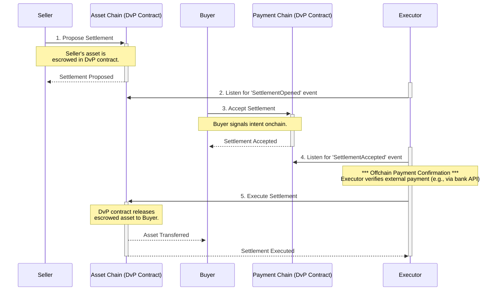
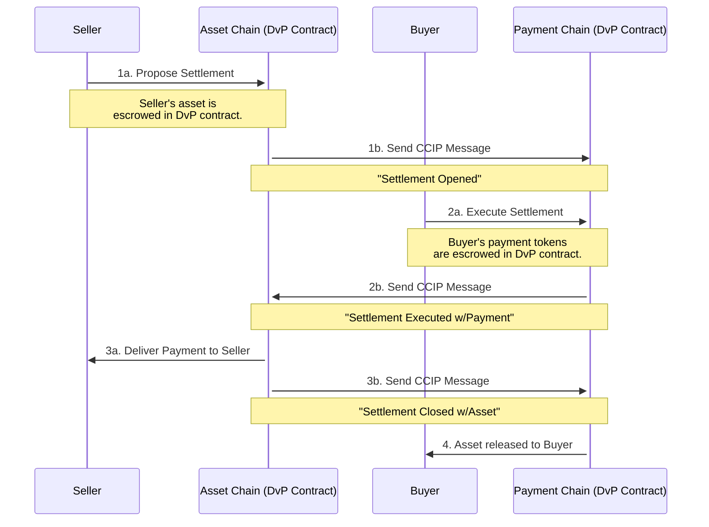

# DvP Service

This page provides a comprehensive overview of the Delivery vs. Payment (DvP) service. We'll walk you through the core concepts, technical details, and practical examples to help you integrate DvP into your applications with confidence.

## What is DvP?

At its core, the DvP service is a decentralized escrow system. It ensures that the transfer of a digital asset from a seller to a buyer only happens if and when the corresponding payment is made. This creates a **trustless environment** for atomic swaps, eliminating the need for a central intermediary and reducing counterparty risk.

Think of it as a smart contract that holds the seller's asset and the buyer's payment, automatically releasing them to the correct parties once all conditions of the trade are met.

## Core concepts

To understand how DvP works, let's first get familiar with the key players and ideas.

### The actors: Who's involved?

Every DvP settlement involves the following key roles:

| Actor        | Role                       | Responsibilities                                                                                                                                                                                                                              |
| :----------- | :------------------------- | :-------------------------------------------------------------------------------------------------------------------------------------------------------------------------------------------------------------------------------------------- |
| **Seller**   | The Asset Provider         | Proposes the settlement, owns the asset to be sold, and is the ultimate recipient of the payment.                                                                                                                                             |
| **Buyer**    | The Asset Purchaser        | Agrees to the settlement terms, provides the payment, and is the ultimate recipient of the asset.                                                                                                                                             |
| **Executor** | The Settlement Facilitator | An **optional** third party that can execute the settlement on behalf of the buyer or seller. This is crucial for automated systems, like a payment network that confirms an offchain bank transfer before finalizing the onchain asset swap. |

### Payment methods: Onchain vs. offchain

- **Onchain Payments**: The trade involves two onchain tokens. The DvP service handles the entire atomic swap automatically.
- **Offchain Payments**: The payment happens outside the blockchain (e.g., a wire transfer). In this case, the `paymentTokenType` is set to `None`, and an **Executor** is typically used to monitor the offchain payment and trigger the onchain asset release once the funds are confirmed.

### The lifecycle of a settlement

A typical DvP trade follows a clear, multi-step lifecycle:

1. **Proposal:** The **Seller** initiates the trade by proposing a settlement. This proposal acts as a digital term sheet, defining the asset, the price, and the rules of the exchange.
2. **Acceptance:** The **Buyer** reviews the proposal. If they agree to the terms, they accept the settlement, locking in the conditions of the trade.
3. **Execution:** Once the settlement is accepted, it can be executed. Execution is the final, atomic step where the asset and payment are swapped. Depending on the setup, execution can be triggered by the **Seller**, the **Buyer**, or an **Executor**.

The diagram below illustrates a common use case involving an **offchain payment** (like a bank wire) that is monitored by a third-party **Executor**. In this flow, the "Asset Chain" and "Payment Chain" represent the onchain environments where the DvP smart contracts are deployed. These contracts act as the escrow agent for the digital asset.

Here is a diagram illustrating a typical cross-chain settlement flow involving an Executor:



### Multi-chain support via CCIP

Assets and payments don't always live on the same blockchain. The DvP service leverages the [**Chainlink Cross-Chain Interoperability Protocol (CCIP)**](https://docs.chain.link/ccip) to facilitate trades across different networks.

- The **Seller** proposes the settlement on the chain where their **asset** is located.
- The **Buyer** accepts the settlement on the chain where their **payment** is located.
- If the payment is offchain, the **Executor** can trigger the final settlement from either chain, but it is most commonly on the chain where the asset token is located.

This feature enables seamless cross-chain settlements.

#### Onchain cross-chain settlement

For a fully onchain transaction (i.e., no offchain payment), the DvP service uses CCIP to coordinate the escrow of assets and payments across two different blockchains. In this scenario, an Executor is not required, as the entire state is managed and verified by the smart contracts themselves.

The flow is as follows:



## Technical deep dive

Now that you understand the concepts, let's look at the technical components that make it all work.

### An event-driven architecture

The DvP service follows an event-driven architecture. The `CCIPDVPCoordinator` smart contract emits events at each stage of the settlement lifecycle (`SettlementOpened`, `SettlementAccepted`, `SettlementSettled`, etc.).

Applications integrating the DvP service should listen for these onchain events and react to them. As shown in the [code example below](#example-executing-a-settlement-as-a-payment-network), an executor service doesn't poll the contract's state. Instead, it uses the `events` client to listen for a `SettlementAccepted` event, and only then does it proceed with its offchain logic and execution. This is the primary mechanism for composing automated systems on top of the DvP service.

### The `Settlement` object: The heart of the trade

Every trade is defined by a `Settlement` object. This is the single source of truth for the terms of the exchange. Below is a breakdown of its structure.

#### The settlement hash

The entire `Settlement` object is hashed to produce a unique **settlement hash**. This hash serves as the primary identifier for the settlement in all subsequent contract interactions. Other than the initial `proposeSettlement` call, all other functions require this `settlementHash` to reference the specific trade you wish to interact with.

The `Settlement` object is composed of the following fields (grouped into logical categories for clarity):

| Field                                          | Type         | Description                                                                                                                                 |
| :--------------------------------------------- | :----------- | :------------------------------------------------------------------------------------------------------------------------------------------ |
| `settlementId`                                 | `uint256`    | A user-defined unique identifier for the settlement.                                                                                        |
| ---                                            | ---          | ---                                                                                                                                         |
| **`partyInfo`**                                | **`struct`** | _**Groups all participant addresses.**_                                                                                                     |
| `partyInfo.buyerSourceAddress`                 | `address`    | The buyer's address on the payment chain.                                                                                                   |
| `partyInfo.buyerDestinationAddress`            | `address`    | The buyer's address on the asset chain.                                                                                                     |
| `partyInfo.sellerSourceAddress`                | `address`    | The seller's address on the asset chain.                                                                                                    |
| `partyInfo.sellerDestinationAddress`           | `address`    | The seller's address on the payment chain.                                                                                                  |
| `partyInfo.executorAddress`                    | `address`    | (Optional) The address of the designated third-party executor.                                                                              |
| ---                                            | ---          | ---                                                                                                                                         |
| **`tokenInfo`**                                | **`struct`** | _**Groups all token and payment details.**_                                                                                                 |
| `tokenInfo.paymentTokenSourceAddress`          | `address`    | The contract address of the payment token on its source chain.                                                                              |
| `tokenInfo.paymentTokenDestinationAddress`     | `address`    | The contract address of the payment token on its destination chain.                                                                         |
| `tokenInfo.assetTokenSourceAddress`            | `address`    | The contract address of the asset token on its source chain.                                                                                |
| `tokenInfo.assetTokenDestinationAddress`       | `address`    | The contract address of the asset token on its destination chain.                                                                           |
| `tokenInfo.paymentCurrency`                    | `uint8`      | For **offchain payments**, this specifies the currency (e.g., "USD", "EUR").                                                                |
| `tokenInfo.paymentTokenAmount`                 | `uint256`    | The amount of the payment token being paid.                                                                                                 |
| `tokenInfo.assetTokenAmount`                   | `uint256`    | The amount of the asset being sold.                                                                                                         |
| `tokenInfo.paymentTokenType`                   | `uint8`      | The type of payment token (e.g., `0` for None, `1` for ERC20).                                                                              |
| `tokenInfo.assetTokenType`                     | `uint8`      | The type of asset token (e.g., `1` for ERC20, `2` for ERC3643).                                                                             |
| ---                                            | ---          | ---                                                                                                                                         |
| **`deliveryInfo`**                             | **`struct`** | _**Groups all cross-chain delivery information.**_                                                                                          |
| `deliveryInfo.paymentSourceChainSelector`      | `uint64`     | The CCIP chain selector for the payment's origin chain.                                                                                     |
| `deliveryInfo.paymentDestinationChainSelector` | `uint64`     | The CCIP chain selector for the payment's destination chain.                                                                                |
| `deliveryInfo.assetSourceChainSelector`        | `uint64`     | The CCIP chain selector for the asset's origin chain.                                                                                       |
| `deliveryInfo.assetDestinationChainSelector`   | `uint64`     | The CCIP chain selector for the asset's destination chain.                                                                                  |
| **--- Other Settlement Fields ---**            |              |                                                                                                                                             |
| `secretHash`                                   | `bytes32`    | (Optional) A hash of a secret. The buyer must provide the original secret to execute the trade, allowing the seller to control the release. |
| `executeAfter`                                 | `uint48`     | A Unix timestamp after which the settlement can be executed.                                                                                |
| `expiration`                                   | `uint48`     | A Unix timestamp by which the settlement must be executed, or it expires.                                                                   |
| `ccipCallbackGasLimit`                         | `uint32`     | The gas limit to provide for the CCIP message processing on the remote chain.                                                               |
| `data`                                         | `bytes`      | Additional data that can be included in the settlement, such as metadata or instructions for the settlement process.                        |

#### Executing with a Secret

The `secretHash` field enables a specific execution flow that gives the seller granular control over the final release of their asset. This method allows the buyer to execute the settlement, but only after the seller provides them with a secret "key".

The process works as follows:

1. **Generation & Hashing:** The **Seller** generates a secret (a random, private piece of data) offchain, computes its hash, and includes this `secretHash` in the settlement proposal.
2. **Payment & Reveal:** The **Buyer** makes the required offchain payment to the Seller. Once the Seller confirms they have received payment, they reveal the original `secret` to the Buyer.
3. **Execution by Buyer:** The Buyer can now trigger the execution. To do this, they call the `executeSettlementWithTokenData` function, providing the `settlementHash` and passing the original `secret` in the `tokenData` field. The DvP contract will then:
   - Check if the `secretHash` in the settlement is non-zero.
   - If so, it will hash the `secret` provided by the buyer (from the `tokenData` field) and require it to match the stored `secretHash`.
   - If the hashes match, the settlement is executed, and the asset is released to the Buyer.

This method allows the Seller to withhold the "key" to the asset until they are satisfied that payment has been made, without needing to act as the onchain executor themselves.

**Trust model distinction**

It is important to note the difference in the trust model between this method and the Executor Service method. In the **Executor** flow, both parties trust a third-party automated service to reliably verify the offchain payment. In the **Buyer with Secret** flow, the Buyer places their trust in the Seller to reveal the secret after payment is made. This model removes the need for a third-party service, giving the Seller direct control over when to release the asset.

### Supported token types

The DvP service is flexible and supports different kinds of tokens:

- **ERC-20**: The standard for fungible tokens, ideal for common cryptocurrencies and utility tokens.
- **ERC-3643**: A standard for permissioned tokens. These often come with a "Hold Manager" contract, which can place a hold on the seller's tokens during the settlement process, ensuring they are available for the final swap without leaving the seller's wallet. The SDK provides a dedicated `PrepareProposeSettlementWithTokenHoldOperation` function for this purpose. When a seller proposes a settlement using this method, the SDK crafts a transaction that calls the `createHold` function on the associated Hold Manager contract. This action creates a temporary, onchain reservation of the assets, guaranteeing they are available for settlement while remaining securely in the seller's custody until the final execution.

### Execution methods

The final settlement can be executed in one of three ways, depending on the needs of the trade:

| Method                | Who Executes | When to Use                                      |
| :-------------------- | :----------- | :----------------------------------------------- |
| **Seller Direct**     | Seller       | Simple peer-to-peer trades.                      |
| **Buyer with Secret** | Buyer        | When the seller provides an unlock secret.       |
| **Executor Service**  | Third-party  | When integrating with external payment networks. |

## Example: Executing a settlement as a payment network

Let's walk through a common use case: an offchain payment network that acts as the **Executor** for a trade.

In this scenario, the payment network observes a real-world payment (e.g., a credit card transaction) and then uses the DvP service to execute the onchain delivery of the digital asset.

### Setup

#### Introducing Smart Accounts

Before we look at the code, it's important to understand a core design principle of the DvP service: its interaction with **Smart Accounts** (also known as Smart Contract Accounts). Unlike traditional accounts controlled by a single private key, smart accounts are contracts themselves, enabling advanced features.

In the setup code below, you'll see that `dvp.NewService` is configured using `ServiceOptions`, which requires an `AccountAddress`. This address must belong to a smart account. The SDK's `transact` package is designed to create and sign `Operations` that this smart account executes. This architecture enables powerful features like:

- **Multi-signature execution:** Requiring multiple parties to sign off on an operation.
- **Batching transactions:** Combining multiple actions (like a token approval and settlement proposal) into one atomic operation.
- **Automated workflows:** Granting an Executor service specific permissions to execute settlements without giving it direct ownership of assets.

Now, let's initialize the necessary clients:

```go
import (
    "context"
    "log"

    "github.com/smartcontractkit/cvn-sdk/client"
    "github.com/smartcontractkit/cvn-sdk/events"
    "github.com/smartcontractkit/cvn-sdk/transact"
    "github.com/smartcontractkit/cvn-sdk/transact/signer"
    "github.com/smartcontractkit/cvn-sdk/services/dvp"
)

// 1. Initialize the CVN Client to connect to the Chainlink Verifiable Network
cvnClient, _ := client.NewCVNClient(cvnURL)

// 2. Create a DVP Service instance. This service is the main entry point for
// interacting with the DvP protocol. It helps create and format operations.
// This requires the onchain address of the DvP Coordinator contract and the
// address of the smart account that will be executing the operations.
dvpService, _ := dvp.NewService(
    &dvp.ServiceOptions{
        DvpCoordinatorAddress: dvpCoordinatorAddress,
        AccountAddress: accountAddress, // The executor's smart account address
    },
)

// 3. Create an Events Client to listen for verified onchain events from the CVN.
// This is used to reliably track the state of a settlement.
cvnEventsClient, _ := events.NewClient(cvnClient, &events.ClientOptions{
    MinRequiredSignatures: 3,
    ValidSigners: []string{ /* ... trusted CVN signer addresses ... */ },
})

// 4. Create a Transact Client to send signed operations to the CVN.
// The CVN will then relay the transaction to the blockchain for execution.
cvnTransactClient, _ := transact.NewClient(cvnClient, &transact.ClientOptions{
    ChainId: "1337", // The chain ID where the execution will happen
})

// 5. Create a local signer. This signer holds the private key of an address
// that is an authorized signer on the executor's smart account. This key is used
// to sign the operation, proving that the executor authorizes the settlement.
operationSigner := signer.NewLocalSigner(privateKey)
```

### Execution Flow

Now, let's process an event and execute the settlement.

```go
// 1. Fetch and verify an event from the CVN
eventList, _ := cvnEventsClient.GetEvents(context.Background())
if len(eventList) == 0 {
    log.Println("No events found.")
    return
}
event := eventList[0]

// The CVN Events client verifies the cryptographic signatures on the event,
// ensuring it is authentic and was emitted by the trusted DvP contract.
verified, _ := cvnEventsClient.Verify(event)
if !verified {
    log.Println("Event verification failed.")
    return
}

// 2. Check if it's a 'SettlementAccepted' event for our DvP service
if event.Service == "dvp" && event.Name == "SettlementAccepted" {

    // At this point, your application would confirm the offchain payment.
    // For example, you might check a database or API to see if the buyer's
    // wire transfer has been received.
    log.Println("Offchain payment confirmed. Preparing to execute settlement.")

    // 3. Decode the verified event into a structured DvP event object
    dvpEvent, _ := dvpService.DecodeSettlementAccepted(event)
    settlementHash := dvpEvent.Event.SettlementHash

    // 4. Prepare the 'executeSettlement' operation using the settlement hash.
    // The dvpService constructs the correct transaction data to call the
    // 'executeSettlement' function on the DvP Coordinator contract.
    operation, _ := dvpService.PrepareExecuteSettlementOperation(settlementHash)

    // 5. Sign the operation with our executor's key. This signature authorizes
    // the smart account to execute the operation.
    signature, _ := cvnTransactClient.SignOperation(operation, operationSigner)

    // 6. Send the signed operation to the CVN to be relayed onchain
    txHash, _ := cvnTransactClient.SendSignedOperation(context.Background(), operation, signature)

    log.Println("Settlement execution sent! Transaction hash:", txHash)
}
```

This example demonstrates the power of the DvP service in bridging the gap between offchain and onchain systems, enabling secure and automated asset delivery.
