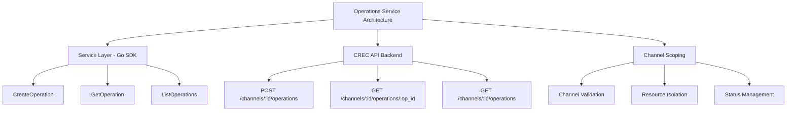
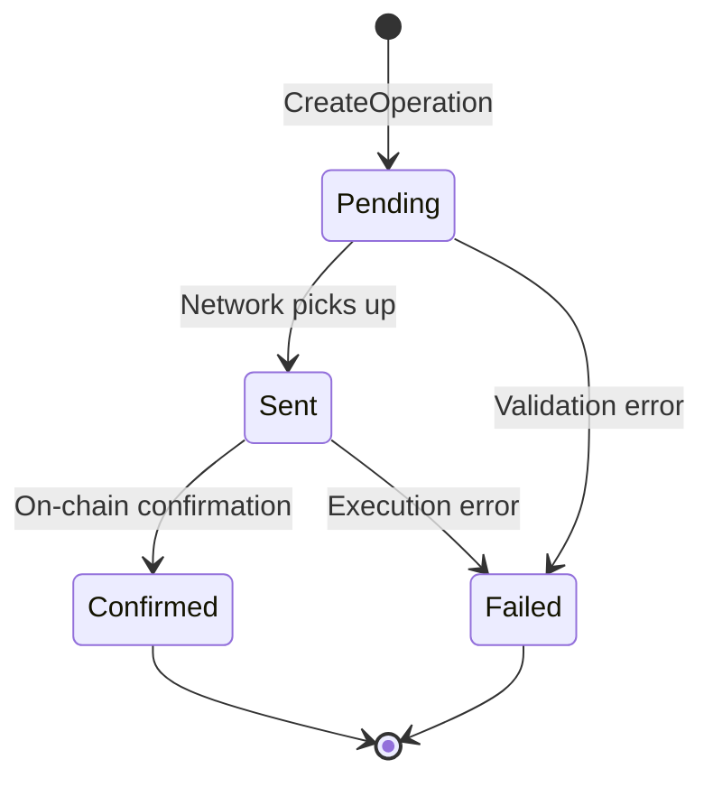

# Operations Service

The Operations Service provides a comprehensive Go SDK for managing operation execution requests in the CREC platform. Operations represent transaction bundles that are sent through channels and executed atomically on-chain using account abstraction.

## Table of Contents

- [Overview](#overview)
- [Architecture](#architecture)
- [Service Configuration](#service-configuration)
- [Operation Management](#operation-management)
- [Usage Examples](#usage-examples)
- [Error Handling](#error-handling)

## Overview

The Operations Service is a **transaction management service** that handles the lifecycle of operation execution requests. Operations are:

- **Atomic Transaction Bundles**: Group multiple transactions to execute together
- **Channel-Scoped**: Each operation belongs to a specific channel
- **Gas-Sponsored**: The CREC network pays for gas fees
- **Status-Tracked**: Monitor operations from pending to confirmed

Think of operations as **"transaction intents"** that you submit to the CREC network for execution, with built-in monitoring and management capabilities.

### Key Benefits

- ✅ **Atomic Execution** - Multiple transactions execute together or not at all
- ✅ **Gas Abstraction** - No need to hold native tokens for gas
- ✅ **Status Tracking** - Monitor operations through their lifecycle
- ✅ **Channel Organization** - Operations are grouped by channel
- ✅ **Filtering & Pagination** - Easily query operations with various filters

## Architecture



## Service Configuration

### ServiceOptions

Configure the operations service with the CREC API client:

```go
import (
    "github.com/smartcontractkit/crec-sdk/client"
    "github.com/smartcontractkit/crec-sdk/services/operations"
)

// 1. Create CREC API client
crecClient, err := client.NewCRECClient(&client.ClientOptions{
    BaseURL: "https://api.crec.chainlink.com",
    APIKey:  "your-api-key",
})
if err != nil {
    log.Fatal(err)
}

// 2. Create Operations service
operationsService, err := operations.NewService(&operations.ServiceOptions{
    CRECClient: crecClient,
    Logger:     logger, // Optional: zerolog.Logger instance
})
if err != nil {
    log.Fatal(err)
}
```

**Configuration Details:**

- **CRECClient**: Required. The authenticated CREC API client instance.
- **Logger**: Optional. A zerolog.Logger instance for service logging. If not provided, a default logger will be created.

## Operation Management

### CreateOperation

Creates a new operation in a specified channel. The operation contains one or more transactions to be executed atomically on-chain.

**Input Parameters:**

- `ChannelID`: UUID of the channel where the operation will be created
- `ChainFamily`: Blockchain family (optional, default: "evm")
- `ChainID`: ID of the blockchain where the operation will execute
- `Address`: Account address performing the operation
- `WalletOperationID`: Unique identifier for the wallet operation
- `Transactions`: List of transactions to execute (at least one required)
- `Signature`: EIP-712 signature of the operation

**Returns:**

- `*uuid.UUID`: The operation ID
- `error`: Error if the operation fails

**Example:**

```go
operationID, err := operationsService.CreateOperation(ctx, operations.CreateOperationInput{
    ChannelID:         channelID,
    ChainID:           "11155111", // Sepolia testnet
    Address:           "0x1234567890123456789012345678901234567890",
    WalletOperationID: "unique-op-id-123",
    Transactions: []operations.TransactionRequest{
        {
            To:    "0xTargetContract",
            Value: "0",
            Data:  "0xencodedcalldata",
        },
    },
    Signature: "0xsignature...",
})
if err != nil {
    log.Fatal(err)
}

fmt.Printf("Operation created with ID: %s\n", operationID)
```

### GetOperation

Retrieves a specific operation by its ID within a channel.

**Input Parameters:**

- `channelID`: UUID of the channel containing the operation
- `operationID`: UUID of the operation to retrieve

**Returns:**

- `*apiClient.Operation`: The operation details
- `error`: Error if the operation is not found or the request fails

**Example:**

```go
operation, err := operationsService.GetOperation(ctx, channelID, operationID)
if err != nil {
    log.Fatal(err)
}

fmt.Printf("Operation Status: %s\n", operation.Status)
fmt.Printf("Chain ID: %s\n", operation.ChainId)
fmt.Printf("Number of Transactions: %d\n", len(operation.Transactions))
```

### ListOperations

Retrieves a list of operations for a channel with optional filtering and pagination.

**Input Parameters:**

- `ChannelID`: UUID of the channel to list operations from (required)
- `Status`: Optional filter for operation status
- `ChainFamily`: Optional filter for blockchain family
- `ChainID`: Optional filter for chain ID
- `Address`: Optional filter for account address
- `Limit`: Maximum number of operations to return (1-100, default: 20)
- `Offset`: Number of operations to skip for pagination (default: 0)

**Returns:**

- `[]apiClient.Operation`: Array of operations
- `bool`: `true` if there are more results available (for pagination)
- `error`: Error if the operation fails

**Example:**

```go
// List all operations with default pagination
operations, hasMore, err := operationsService.ListOperations(ctx, operations.ListOperationsInput{
    ChannelID: channelID,
})
if err != nil {
    log.Fatal(err)
}

for _, op := range operations {
    fmt.Printf("- Operation %s: %s\n", op.OperationId, op.Status)
}

if hasMore {
    fmt.Println("More operations available...")
}
```

**Example with Filters:**

```go
// Filter operations by status and chain
status := "pending"
chainID := "11155111"
limit := 10
offset := 0

operations, hasMore, err := operationsService.ListOperations(ctx, operations.ListOperationsInput{
    ChannelID: channelID,
    Status:    &status,
    ChainID:   &chainID,
    Limit:     &limit,
    Offset:    &offset,
})
if err != nil {
    log.Fatal(err)
}
```

## Usage Examples

### Complete Workflow: Creating and Tracking Operations

This example demonstrates a complete workflow for creating an operation, submitting it to a channel, and monitoring its status.

```go
package main

import (
    "context"
    "fmt"
    "log"
    "time"

    "github.com/google/uuid"
    "github.com/smartcontractkit/crec-sdk/client"
    "github.com/smartcontractkit/crec-sdk/services/channels"
    "github.com/smartcontractkit/crec-sdk/services/operations"
)

func main() {
    ctx := context.Background()

    // 1. Initialize CREC client
    crecClient, err := client.NewCRECClient(&client.ClientOptions{
        BaseURL: "https://api.crec.chainlink.com",
        APIKey:  "your-api-key",
    })
    if err != nil {
        log.Fatal(err)
    }

    // 2. Create services
    channelsService, err := channels.NewService(&channels.ServiceOptions{
        CRECClient: crecClient,
    })
    if err != nil {
        log.Fatal(err)
    }

    operationsService, err := operations.NewService(&operations.ServiceOptions{
        CRECClient: crecClient,
    })
    if err != nil {
        log.Fatal(err)
    }

    // 3. Create a channel
    channel, err := channelsService.CreateChannel(ctx, channels.CreateChannelInput{
        Name: "my-operations-channel",
    })
    if err != nil {
        log.Fatal(err)
    }
    fmt.Printf("✓ Created channel: %s\n", channel.ChannelId)

    // 4. Create an operation
    operationID, err := operationsService.CreateOperation(ctx, operations.CreateOperationInput{
        ChannelID:         channel.ChannelId,
        ChainID:           "11155111", // Sepolia testnet
        Address:           "0x1234567890123456789012345678901234567890",
        WalletOperationID: fmt.Sprintf("op-%d", time.Now().Unix()),
        Transactions: []operations.TransactionRequest{
            {
                To:    "0xTargetContract",
                Value: "0",
                Data:  "0xencodedcalldata",
            },
        },
        Signature: "0xsignature...",
    })
    if err != nil {
        log.Fatal(err)
    }
    fmt.Printf("✓ Created operation: %s\n", operationID)

    // 5. Monitor operation status
    fmt.Println("\nMonitoring operation status...")
    for i := 0; i < 10; i++ {
        operation, err := operationsService.GetOperation(ctx, channel.ChannelId, *operationID)
        if err != nil {
            log.Fatal(err)
        }

        fmt.Printf("  Status: %s\n", operation.Status)

        if operation.Status == "confirmed" {
            fmt.Println("✓ Operation confirmed!")
            break
        }

        if operation.Status == "failed" {
            fmt.Println("✗ Operation failed")
            break
        }

        time.Sleep(3 * time.Second)
    }

    // 6. List all operations in the channel
    fmt.Println("\nAll operations in channel:")
    allOperations, _, err := operationsService.ListOperations(ctx, operations.ListOperationsInput{
        ChannelID: channel.ChannelId,
    })
    if err != nil {
        log.Fatal(err)
    }

    for _, op := range allOperations {
        fmt.Printf("  - %s: %s (%d transactions)\n", 
            op.OperationId, op.Status, len(op.Transactions))
    }
}
```

### Pagination Example

```go
func listAllOperations(ctx context.Context, service *operations.Service, channelID uuid.UUID) ([]apiClient.Operation, error) {
    var allOperations []apiClient.Operation
    limit := 20
    offset := 0

    for {
        operations, hasMore, err := service.ListOperations(ctx, operations.ListOperationsInput{
            ChannelID: channelID,
            Limit:     &limit,
            Offset:    &offset,
        })
        if err != nil {
            return nil, err
        }

        allOperations = append(allOperations, operations...)

        if !hasMore {
            break
        }

        offset += limit
    }

    return allOperations, nil
}
```

### Filtering by Status

```go
func getPendingOperations(ctx context.Context, service *operations.Service, channelID uuid.UUID) ([]apiClient.Operation, error) {
    status := "pending"
    operations, _, err := service.ListOperations(ctx, operations.ListOperationsInput{
        ChannelID: channelID,
        Status:    &status,
    })
    return operations, err
}

func getConfirmedOperations(ctx context.Context, service *operations.Service, channelID uuid.UUID) ([]apiClient.Operation, error) {
    status := "confirmed"
    operations, _, err := service.ListOperations(ctx, operations.ListOperationsInput{
        ChannelID: channelID,
        Status:    &status,
    })
    return operations, err
}
```

### Error Handling Example

```go
func createOperationSafely(ctx context.Context, service *operations.Service, input operations.CreateOperationInput) (*uuid.UUID, error) {
    operationID, err := service.CreateOperation(ctx, input)
    if err != nil {
        // Check for specific error types
        if strings.Contains(err.Error(), "channel not found") {
            // Handle channel not found
            return nil, fmt.Errorf("channel does not exist: %w", err)
        }
        if strings.Contains(err.Error(), "unexpected status code: 400") {
            // Handle bad request (invalid input)
            return nil, fmt.Errorf("invalid operation data: %w", err)
        }
        return nil, err
    }
    return operationID, nil
}
```

## Error Handling

The Operations Service returns descriptive errors for various failure scenarios:

### Common Errors

| Error | Description | HTTP Status |
|-------|-------------|-------------|
| `channel_id is required` | Channel ID not provided | N/A (validation) |
| `chain_id is required` | Chain ID not provided | N/A (validation) |
| `address is required` | Account address not provided | N/A (validation) |
| `wallet_operation_id is required` | Wallet operation ID not provided | N/A (validation) |
| `at least one transaction is required` | No transactions in operation | N/A (validation) |
| `signature is required` | Signature not provided | N/A (validation) |
| `channel not found: <id>` | Channel with specified ID doesn't exist | 404 |
| `operation not found: <id>` | Operation with specified ID doesn't exist | 404 |
| `unexpected status code: 400` | Invalid request (e.g., invalid signature) | 400 |
| `unexpected status code: 500` | Internal server error | 500 |

### Error Handling Best Practices

1. **Always check for errors**: Never ignore error returns
2. **Log errors with context**: Include operation IDs and channel IDs in error logs
3. **Handle specific cases**: Check for 404 (not found) vs 400 (bad request) vs 500 (server error)
4. **Implement retries**: For transient errors (5xx), consider retry logic
5. **Validate inputs**: Check parameters before making API calls

```go
operationID, err := operationsService.CreateOperation(ctx, input)
if err != nil {
    if strings.Contains(err.Error(), "channel not found") {
        // Handle not found case
        log.Warn().Str("channel_id", input.ChannelID.String()).Msg("Channel not found")
        return nil
    }
    // Handle other errors
    log.Error().Err(err).Msg("Failed to create operation")
    return err
}
```

## Operation Lifecycle

Operations go through several states during their lifecycle:

1. **Pending**: Operation has been created and is waiting to be sent
2. **Sent**: Operation has been sent to the blockchain
3. **Confirmed**: Operation has been confirmed on-chain
4. **Failed**: Operation execution failed



## Integration with Other CREC Services

Operations are tightly integrated with channels and work alongside other CREC services:

1. **Channels**: Operations must be created within a channel
2. **Accounts**: Operations are executed by account contracts
3. **Events**: Operation status changes generate events
4. **Watchers**: Can monitor operation-related events

Example integration:

```go
// 1. Create a channel
channel, _ := channelsService.CreateChannel(ctx, channels.CreateChannelInput{
    Name: "dvp-settlements",
})

// 2. Create an operation in the channel
operationID, _ := operationsService.CreateOperation(ctx, operations.CreateOperationInput{
    ChannelID:         channel.ChannelId,
    ChainID:           "1",
    Address:           accountAddress,
    WalletOperationID: "settlement-op-123",
    Transactions:      transactions,
    Signature:         signature,
})

// 3. Monitor operation through events (using events service)
events, _ := eventsService.ListEvents(ctx, eventsInput)
```

## Best Practices

1. **Use Descriptive Operation IDs**: Choose wallet operation IDs that clearly indicate their purpose (e.g., `dvp-settlement-12345`, `token-transfer-67890`)

2. **Monitor Operation Status**: Always check operation status after creation, especially for critical transactions

3. **Handle Failures Gracefully**: Implement proper error handling and retry logic for failed operations

4. **Validate Before Submitting**: Ensure all transaction data is valid before creating operations

5. **Use Appropriate Filters**: When listing operations, use filters to narrow down results and improve performance

6. **Implement Pagination**: Always handle pagination properly when listing operations to avoid missing results

7. **Track Operation IDs**: Store operation IDs in your application database for audit trails and troubleshooting

8. **Use Channels Wisely**: Organize operations into channels by business context for better management

