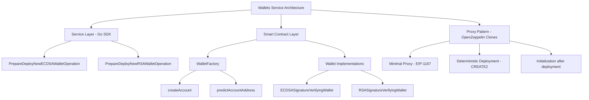
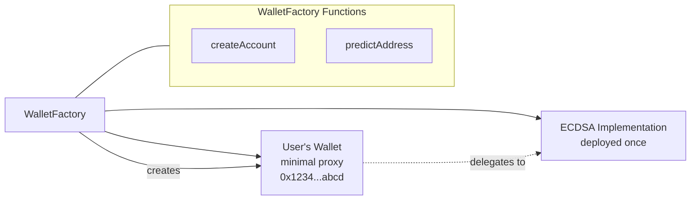

# Wallets Service

The Wallets Service provides a comprehensive Go SDK for provisioning and deploying smart wallets on the CREC platform. This service enables users to create deterministic, signature-verifying wallet contracts that serve as the foundation for executing CREC business operations like DvP settlements and DTA transactions.

## Table of Contents

- [Overview](#overview)
- [Architecture](#architecture)
- [Smart Contract Foundation](#smart-contract-foundation)
- [Service Configuration](#service-configuration)
- [Wallet Types](#wallet-types)
- [Operation Preparation](#operation-preparation)
- [Contract Integration](#contract-integration)

## Overview

The Wallets Service is a **provisioning service** that creates smart wallets for CREC users. This service focuses on the **infrastructure layer** - deploying the wallet contracts that users need to participate in CREC operations.

Think of it as the **"wallet factory"** that creates the secure, signature-verifying contracts that CREC users control. Once deployed, these wallets become the execution layer for all CREC business operations.

### Key Benefits

- ✅ **Deterministic Deployment** using OpenZeppelin's Clone Factory pattern
- ✅ **Multiple Signature Types** supporting both ECDSA and RSA verification
- ✅ **Gas Efficient** using minimal proxy clones (EIP-1167)
- ✅ **Keystone Integration** for decentralized oracle reporting
- ✅ **Type-Safe Operations** with comprehensive ABI encoding
- ✅ **Predictable Addresses** for wallet address calculation before deployment

## Architecture



## Smart Contract Foundation

The Wallets Service leverages **OpenZeppelin's Clone Factory pattern** to create gas-efficient, deterministic wallet deployments. This architecture separates **implementation contracts** from **proxy contracts**, enabling cost-effective scaling.

### The Clone Factory Pattern

Instead of deploying full contract bytecode for each wallet (expensive), the system:

1. **Deploys implementation contracts once** (ECDSAWallet, RSAWallet, etc.)
2. **Creates minimal proxies** (EIP-1167) that delegate calls to implementations
3. **Uses deterministic salts** to ensure predictable addresses
4. **Initializes after deployment** with user-specific configuration



### WalletFactory Contract

The `WalletFactory` is the central deployment contract that:

**Core Functions:**

# TODO: Change when renamed

- `createAccount()` - Deploys new wallet proxies with deterministic addresses
- `predictAccountAddress()` - Calculates wallet addresses before deployment
- `getSalt()` - Generates deterministic salts from creator + walletId

**Key Features:**

- **Deterministic Addresses**: Uses CREATE2 with `keccak256(creator, walletId)` salt
- **Duplicate Prevention**: Reverts if wallet already exists at predicted address
- **Automatic Initialization**: Calls `initialize()` on deployed proxy immediately
- **Gas Efficiency**: Minimal proxy deployment ~45k gas vs ~500k+ for full contracts

### Abstract Wallet Base Class

All wallet implementations inherit from the `Account` abstract contract, providing:

**Common Functionality:**

- **EIP-712 Domain Setup** for typed data signing
- **Keystone Forwarder Integration** for oracle reporting
- **Owner Management** using OpenZeppelin's upgradeable ownership
- **Template Method Pattern** for implementation-specific configuration

**Initialization Flow:**

```solidity
function initialize(
    address keystoneForwarder,  // CRE Keystone Forwarder contract
    address initialOwner,       // Wallet owner
    bytes calldata configParams // Implementation-specific signers
) public initializer
```

**Configuration Pattern:**
The base class uses the **template method pattern** where concrete implementations override `_configure()` to handle their specific signer encoding (ECDSA addresses vs RSA key pairs).

## Service Configuration

### ServiceOptions

Configure the wallets service with all required contract addresses:

**Configuration Details:**

- **KeystoneForwarder**: The CREC oracle system that will call `onReport()` on deployed wallets
- **Walletactory**: The factory contract that creates minimal proxy clones
- **Implementation Addresses**: Pre-deployed implementation contracts for each signature type

- **Cross-chain Consistency**: Same wallet ID on different chains (if desired)

## Operation Preparation

The service provides two main operations for wallet deployment:

### PrepareDeployNewECDSAWalletOperation

Creates a deployment operation for ECDSA-based signature verification.

**Parameters:**

- `walletOwnerAddress`: The Ethereum address that will own the deployed wallet contract
- `allowedSigners`: Array of Ethereum addresses authorized to sign transactions for this wallet
- `walletId`: Human-readable unique identifier (combined with creator to ensure uniqueness)

### PrepareDeployNewRSAWalletOperation

Creates a deployment operation for RSA-based signature verification.

**Parameters:**

- `walletOwnerAddress`: The Ethereum address that will own the deployed wallet contract
- `allowedSigners`: Array of RSA public keys (E and N components as hex strings)
- `walletId`: Human-readable unique identifier (combined with creator to ensure uniqueness)

### Common Operation Flow

Both operations follow the same internal flow:

1. **Validate Parameters**: Check addresses and signer data format
2. **Encode Signers**: ABI-encode signer data according to wallet type
3. **Generate Calldata**: Create `createAccount()` function call with parameters
4. **Return Operation**: Package transaction for execution framework

## Contract Integration

### WalletFactory Integration

The service integrates with the WalletFactory contract through these key interactions:

**createAccount Function Signature:**

```solidity
function createAccount(
    address implementation,        // Implementation contract address
    bytes32 uniqueAccountId,      // Keccak256 hash of account ID string
    address keystoneForwarder,    // CREC oracle forwarder address
    address initialOwner,         // Account owner address
    bytes calldata configData     // ABI-encoded signer configuration
) external returns (address accountAddress)
```

**Parameter Mapping:**

- `implementation`: Selected based on account type (ECDSA vs RSA)
- `uniqueAccountId`: `crypto.Keccak256Hash([]byte(accountId))`
- `keystoneForwarder`: From service configuration
- `initialOwner`: `common.HexToAddress(accountOwnerAddress)`
- `configData`: ABI-encoded signer data (address[] or (bytes,bytes)[])

### Deterministic Addresses

Wallets are deployed with deterministic addresses using CREATE2:

```solidity
// Salt generation
bytes32 salt = keccak256(abi.encodePacked(msg.sender, uniqueAccountId));

// Address prediction
address predicted = Clones.predictDeterministicAddress(implementation, salt);
```

This enables:

- **Pre-deployment Address Calculation**: Know wallet address before deployment
- **Duplicate Prevention**: Same creator + walletId always produces same address
- **Cross-chain Consistency**: Same wallet ID on different chains (if desired)

## Example: Deploying and registering a smart wallet

Let's walk through a practical example of deploying a new ECDSA signature verifying wallet and registering it with the CREC backend.

This example demonstrates the complete flow from wallet creation to backend registration, which is essential for applications that need to provision smart wallets for their users.

### Setup

```go
import (
    "context"
    "time"

    "github.com/google/uuid"
    "github.com/ethereum/go-ethereum/crypto"
    apiClient "github.com/smartcontractkit/crec-api-go/client"
    "github.com/smartcontractkit/crec-sdk/client"
    "github.com/smartcontractkit/crec-sdk/services/wallets"
    "github.com/smartcontractkit/crec-sdk/transact"
    "github.com/smartcontractkit/crec-sdk/transact/signer/local"
)

// 1. Initialize the CREC Client to connect to the Chainlink Verifiable Network
crecClient, _ := client.NewCRECClient(crecURL, crecAPIKey)

// 2. Create an Accounts Service instance. This service handles smart wallet
// provisioning operations and address prediction.
walletsService, _ := wallets.NewService(&wallets.ServiceOptions{
    OperationExecutionAccount:                 operationExecutionAccountAddress, // Smart wallet that will execute the deployment
    KeystoneForwarderAddress:                  keystoneForwarderAddress,         // Keystone forwarder contract
    WalletFactoryAddress:                      walletFactoryAddress,            // Account factory contract
    ECDSASignatureVerifyingAccountImplAddress: ecdsaImplAddress,                // ECDSA wallet implementation
    RSASignatureVerifyingAccountImplAddress:   rsaImplAddress,                  // RSA wallet implementation
})

// 3. Create a Transact Client to send signed operations to the CREC
transactClient, _ := transact.NewClient(&transact.ClientOptions{
    CRECClient: crecClient,
    ChainId:   chainId,
})

// 4. Create a local signer for the operation execution wallet
operationSigner := local.NewSigner(privateKey)
```

### Deployment and Registration Flow

```go
ctx := context.Background()

// 1. Prepare the ECDSA wallet deployment operation
// This creates the operation and predicts where the wallet will be deployed
operation, predictedAddress, _ := walletsService.PrepareDeployNewECDSAWalletOperation(
    walletOwnerAddress, // The address that will own the deployed wallet
    "trading-wallet-1", // Unique identifier for this wallet
)

// The predicted address is deterministic - it will be the same as the actual
// deployed address once the operation is executed on-chain

// 2. Sign and send the operation to the CREC
operationHash, signature, _ := transactClient.SignOperation(ctx, operation, operationSigner)
txResult, _ := transactClient.SendSignedOperation(ctx, operation, signature)

// 3. Wait for the operation to be executed on-chain
// In a real application, you might want to implement proper retry logic
// and handle different status states more gracefully
operationUUID, _ := uuid.Parse(txResult.OperationId.String())

for {
    status, _ := transactClient.GetOperation(ctx, operationUUID)
    if status != nil && status.Status == "confirmed" {
        break
    }
    time.Sleep(3 * time.Second)
}

// 4. Register the deployed wallet with the CREC backend
// This makes the wallet discoverable and manageable through CREC APIs
walletName := "My Trading Wallet"
walletData := apiClient.CreateWallet{
    Address: predictedAddress.Hex(),
    ChainId: chainId,
    Name:    &walletName, // Optional: human-readable name for the account
}

response, _ := crecClient.PostAccountsWithResponse(ctx, walletData)
```

This example demonstrates the power of the Accounts Service in providing a secure, predictable foundation for CREC applications that need to provision smart wallets at scale.
