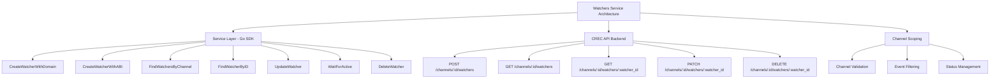

# Watchers Service

The Watchers Service provides a comprehensive Go SDK for managing blockchain event watchers in the CREC platform. Watchers monitor specific smart contract events on blockchain networks and trigger workflows when those events occur. They can be configured either with pre-defined domain ABIs or custom event ABIs.

## Table of Contents

- [Overview](#overview)
- [Architecture](#architecture)
- [Service Configuration](#service-configuration)
- [Watcher Operations](#watcher-operations)
- [Usage Examples](#usage-examples)
- [Error Handling](#error-handling)

## Overview

The Watchers Service is a **blockchain monitoring service** that enables real-time event detection on smart contracts. Watchers act as:

- **Event Detectors**: Monitor blockchain for specific contract events
- **Workflow Triggers**: Automatically trigger actions when events are detected
- **Domain-Aware**: Support for pre-configured domain types (DvP, DTA, test consumers)
- **Custom ABI Support**: Define custom event structures for any smart contract

Think of watchers as **"event listeners"** that continuously monitor blockchain activity and notify your application when specific events occur.

### Key Benefits

- ✅ **Real-Time Monitoring** - Detect blockchain events as they happen
- ✅ **Domain Support** - Pre-configured ABIs for DvP, DTA, and test consumer contracts
- ✅ **Custom Events** - Define any event structure with custom ABIs
- ✅ **Automatic Deployment** - Watchers are deployed automatically after creation
- ✅ **Status Tracking** - Monitor watcher deployment and health status
- ✅ **Channel Organization** - Watchers are scoped to channels for better organization

## Architecture



## Service Configuration

### ServiceOptions

Configure the watchers service with the CREC API client:

```go
import (
    "github.com/smartcontractkit/crec-sdk/client"
    "github.com/smartcontractkit/crec-sdk/services/watchers"
)

// 1. Create CREC API client
crecClient, err := client.NewCRECClient(&client.ClientOptions{
    BaseURL: "https://api.crec.chainlink.com",
    APIKey:  "your-api-key",
})
if err != nil {
    log.Fatal(err)
}

// 2. Create Watchers service
watchersService, err := watchers.NewService(&watchers.ServiceOptions{
    CRECClient: crecClient,
    Logger:     logger, // Optional: zerolog.Logger instance
})
if err != nil {
    log.Fatal(err)
}
```

**Configuration Details:**

- **CRECClient**: Required. The authenticated CREC API client instance.
- **Logger**: Optional. A zerolog.Logger instance for service logging. If not provided, a default logger will be created.

## Watcher Operations

### CreateWatcherWithDomain

Creates a new watcher using a pre-defined domain type. Domains provide pre-configured event ABIs for known contract types.

**Supported Domains:**
- `dvp` - Delivery vs Payment contracts
- `dta` - Digital Trade Agreements contracts  
- `test_consumer` - Test consumer contracts

**Input Parameters:**

- `ChannelID`: UUID of the channel where the watcher will be created
- `Name`: Optional friendly name for the watcher
- `ChainSelector`: The chain selector to identify the blockchain
- `Address`: Smart contract address to watch for events
- `Domain`: Domain type (dvp, dta, or test_consumer)
- `Events`: List of event names to watch for within the domain

**Returns:**

- `*apiClient.Watcher`: The created watcher with ID and status
- `error`: Error if the operation fails

**Example:**

```go
name := "Production DVP Watcher"
watcher, err := watchersService.CreateWatcherWithDomain(ctx, channelID, watchers.CreateWatcherWithDomainInput{
    Name:          &name,
    ChainSelector: 1,
    Address:       "0x1234567890123456789012345678901234567890",
    Domain:        "dvp",
    Events:        []string{"OperationExecuted", "OperationCreated"},
})
if err != nil {
    log.Fatal(err)
}

fmt.Printf("Created watcher: %s (Status: %s)\n", watcher.WatcherId, watcher.Status)
```

### Create a Watcher with Custom ABI

Creates a new watcher with a custom event ABI. Use this when monitoring contracts that don't fit into pre-defined domains.

**Input Parameters:**

- `ChannelID`: UUID of the channel where the watcher will be created
- `Name`: Optional friendly name for the watcher
- `ChainSelector`: The chain selector to identify the blockchain
- `Address`: Smart contract address to watch for events
- `Events`: List of event names to watch for
- `ABI`: Array of event ABI definitions

**Returns:**

- `*apiClient.Watcher`: The created watcher with ID and status
- `error`: Error if the operation fails

**Example:**

```go
name := "ERC20 Transfer Watcher"
watcher, err := watchersService.CreateWatcherWithABI(ctx, channelID, watchers.CreateWatcherWithABIInput{
    Name:          &name,
    ChainSelector: 1,
    Address:       "0x1234567890123456789012345678901234567890",
    Events:        []string{"Transfer"},
    ABI: []watchers.EventABI{
        {
            Type: "event",
            Name: "Transfer",
            Inputs: []watchers.EventABIInput{
                {
                    Name:         "from",
                    Type:         "address",
                    InternalType: "address",
                    Indexed:      true,
                },
                {
                    Name:         "to",
                    Type:         "address",
                    InternalType: "address",
                    Indexed:      true,
                },
                {
                    Name:         "value",
                    Type:         "uint256",
                    InternalType: "uint256",
                    Indexed:      false,
                },
            },
        },
    },
})
if err != nil {
    log.Fatal(err)
}

fmt.Printf("Created watcher: %s\n", watcher.WatcherId)
```

### FindWatchersByChannel

Retrieves a list of watchers for a channel with optional filtering and pagination.

**Input Parameters:**

- `ChannelID`: UUID of the channel to list watchers from (required)
- `Filters`: Optional filtering criteria:
  - `Limit`: Maximum number of watchers to return (default: 20)
  - `Offset`: Number of watchers to skip for pagination (default: 0)
  - `Name`: Filter by name (partial match, case-insensitive)
  - `Status`: Filter by status (pending, active, failed, deleting, deleted)
  - `ChainSelector`: Filter by chain selector
  - `Address`: Filter by contract address
  - `Domain`: Filter by domain
  - `EventName`: Filter by specific event name being monitored

**Returns:**

- `*apiClient.WatcherList`: List of watchers with pagination info
- `error`: Error if the operation fails

**Example:**

```go
// List all watchers with default pagination
watchersList, err := watchersService.FindWatchersByChannel(ctx, channelID, watchers.WatcherFilters{})
if err != nil {
    log.Fatal(err)
}

for _, w := range watchersList.Data {
    fmt.Printf("- Watcher: %s (Status: %s, Address: %s)\n", 
        w.WatcherId, w.Status, w.Address)
}

if watchersList.HasMore {
    fmt.Println("More watchers available...")
}
```

**Example with Filters:**

```go
// Filter active watchers on Ethereum mainnet
status := watchers.StatusActive
chainSelector := uint64(1)
limit := 10

watchersList, err := watchersService.FindWatchersByChannel(ctx, channelID, watchers.WatcherFilters{
    Status:        &status,
    ChainSelector: &chainSelector,
    Limit:         &limit,
})
if err != nil {
    log.Fatal(err)
}

fmt.Printf("Found %d active watchers on Ethereum\n", len(watchersList.Data))
```

### FindWatcherByID

Retrieves a specific watcher by its ID within a channel.

**Input Parameters:**

- `channelID`: UUID of the channel containing the watcher
- `watcherID`: UUID of the watcher to retrieve

**Returns:**

- `*apiClient.Watcher`: The watcher details
- `error`: Error if the watcher is not found or the operation fails

**Example:**

```go
watcher, err := watchersService.FindWatcherByID(ctx, channelID, watcherID)
if err != nil {
    log.Fatal(err)
}

fmt.Printf("Watcher: %s\n", watcher.WatcherId)
fmt.Printf("Status: %s\n", watcher.Status)
fmt.Printf("Address: %s\n", watcher.Address)
fmt.Printf("Events: %v\n", watcher.Events)
```

### UpdateWatcher

Updates a watcher's metadata (currently only the name can be updated).

**Input Parameters:**

- `channelID`: UUID of the channel containing the watcher
- `watcherID`: UUID of the watcher to update
- `input`: Update parameters
  - `Name`: New name for the watcher (required)

**Returns:**

- `*apiClient.Watcher`: The updated watcher
- `error`: Error if the operation fails

**Example:**

```go
updatedWatcher, err := watchersService.UpdateWatcher(ctx, channelID, watcherID, watchers.UpdateWatcherInput{
    Name: "Updated Production DVP Watcher",
})
if err != nil {
    log.Fatal(err)
}

fmt.Printf("Updated watcher name to: %s\n", *updatedWatcher.Name)
```

### WaitForActive

Polls a watcher until it reaches active status or fails. Watchers are created in a `pending` state and must be deployed before becoming `active`.

**Input Parameters:**

- `channelID`: UUID of the channel containing the watcher
- `watcherID`: UUID of the watcher to monitor
- `maxWaitTime`: Maximum duration to wait for activation

**Returns:**

- `*apiClient.Watcher`: The active watcher
- `error`: Error if deployment fails or timeout occurs

**Example:**

```go
// Wait up to 2 minutes for the watcher to become active
activeWatcher, err := watchersService.WaitForActive(ctx, channelID, watcher.WatcherId, 2*time.Minute)
if err != nil {
    log.Fatal(err)
}

fmt.Printf("Watcher is now active: %s\n", activeWatcher.WatcherId)
```

### DeleteWatcher

Deletes a watcher from a channel. The watcher will stop monitoring events and be removed from the system.

**Input Parameters:**

- `channelID`: UUID of the channel containing the watcher
- `watcherID`: UUID of the watcher to delete

**Returns:**

- `error`: Error if the watcher is not found or the operation fails

**Example:**

```go
err := watchersService.DeleteWatcher(ctx, channelID, watcherID)
if err != nil {
    log.Fatal(err)
}

fmt.Println("Watcher deleted successfully")
```

## Usage Examples

### Complete Workflow: Creating and Monitoring a Watcher

This example demonstrates a complete workflow for creating a watcher with a domain, waiting for activation, and monitoring its status.

```go
package main

import (
    "context"
    "fmt"
    "log"
    "time"

    "github.com/google/uuid"
    "github.com/smartcontractkit/crec-sdk/client"
    "github.com/smartcontractkit/crec-sdk/services/channels"
    "github.com/smartcontractkit/crec-sdk/services/watchers"
)

func main() {
    ctx := context.Background()

    // 1. Initialize CREC client
    crecClient, err := client.NewCRECClient(&client.ClientOptions{
        BaseURL: "https://api.crec.chainlink.com",
        APIKey:  "your-api-key",
    })
    if err != nil {
        log.Fatal(err)
    }

    // 2. Create services
    channelsService, err := channels.NewService(&channels.ServiceOptions{
        CRECClient: crecClient,
    })
    if err != nil {
        log.Fatal(err)
    }

    watchersService, err := watchers.NewService(&watchers.ServiceOptions{
        CRECClient: crecClient,
    })
    if err != nil {
        log.Fatal(err)
    }

    // 3. Create a channel
    channel, err := channelsService.CreateChannel(ctx, channels.CreateChannelInput{
        Name: "dvp-monitoring-channel",
    })
    if err != nil {
        log.Fatal(err)
    }
    fmt.Printf("✓ Created channel: %s\n", channel.ChannelId)

    // 4. Create a watcher with domain
    name := "DVP Operations Watcher"
    watcher, err := watchersService.CreateWatcherWithDomain(ctx, channel.ChannelId, watchers.CreateWatcherWithDomainInput{
        Name:          &name,
        ChainSelector: 1, // Ethereum mainnet
        Address:       "0x1234567890123456789012345678901234567890",
        Domain:        "dvp",
        Events:        []string{"OperationExecuted"},
    })
    if err != nil {
        log.Fatal(err)
    }
    fmt.Printf("✓ Created watcher: %s (Status: %s)\n", watcher.WatcherId, watcher.Status)

    // 5. Wait for watcher to become active
    fmt.Println("\nWaiting for watcher deployment...")
    activeWatcher, err := watchersService.WaitForActive(ctx, channel.ChannelId, watcher.WatcherId, 2*time.Minute)
    if err != nil {
        log.Fatal(err)
    }
    fmt.Printf("✓ Watcher is now active: %s\n", activeWatcher.WatcherId)

    // 6. Update watcher name
    updatedWatcher, err := watchersService.UpdateWatcher(ctx, channel.ChannelId, watcher.WatcherId, watchers.UpdateWatcherInput{
        Name: "Production DVP Watcher",
    })
    if err != nil {
        log.Fatal(err)
    }
    fmt.Printf("✓ Updated watcher name to: %s\n", *updatedWatcher.Name)

    // 7. List all active watchers
    fmt.Println("\nAll active watchers:")
    status := watchers.StatusActive
    watchersList, err := watchersService.FindWatchersByChannel(ctx, channel.ChannelId, watchers.WatcherFilters{
        Status: &status,
    })
    if err != nil {
        log.Fatal(err)
    }

    for _, w := range watchersList.Data {
        fmt.Printf("  - %s: %s (Address: %s)\n", w.WatcherId, w.Status, w.Address)
    }

    // 8. Delete the watcher (cleanup)
    fmt.Println("\nCleaning up...")
    err = watchersService.DeleteWatcher(ctx, channel.ChannelId, watcher.WatcherId)
    if err != nil {
        log.Fatal(err)
    }
    fmt.Printf("✓ Deleted watcher: %s\n", watcher.WatcherId)
}
```

### Creating a Custom ERC20 Watcher

```go
func createERC20Watcher(ctx context.Context, service *watchers.Service, channelID uuid.UUID, tokenAddress string) (*apiClient.Watcher, error) {
    name := "ERC20 Token Watcher"
    
    watcher, err := service.CreateWatcherWithABI(ctx, channelID, watchers.CreateWatcherWithABIInput{
        Name:          &name,
        ChainSelector: 1, // Ethereum mainnet
        Address:       tokenAddress,
        Events:        []string{"Transfer", "Approval"},
        ABI: []watchers.EventABI{
            {
                Type: "event",
                Name: "Transfer",
                Inputs: []watchers.EventABIInput{
                    {Name: "from", Type: "address", InternalType: "address", Indexed: true},
                    {Name: "to", Type: "address", InternalType: "address", Indexed: true},
                    {Name: "value", Type: "uint256", InternalType: "uint256", Indexed: false},
                },
            },
            {
                Type: "event",
                Name: "Approval",
                Inputs: []watchers.EventABIInput{
                    {Name: "owner", Type: "address", InternalType: "address", Indexed: true},
                    {Name: "spender", Type: "address", InternalType: "address", Indexed: true},
                    {Name: "value", Type: "uint256", InternalType: "uint256", Indexed: false},
                },
            },
        },
    })
    if err != nil {
        return nil, err
    }

    // Wait for activation
    return service.WaitForActive(ctx, channelID, watcher.WatcherId, 2*time.Minute)
}
```

### Pagination Example

```go
func listAllWatchers(ctx context.Context, service *watchers.Service, channelID uuid.UUID) ([]apiClient.Watcher, error) {
    var allWatchers []apiClient.Watcher
    limit := 20
    offset := 0

    for {
        watchersList, err := service.FindWatchersByChannel(ctx, channelID, watchers.WatcherFilters{
            Limit:  &limit,
            Offset: &offset,
        })
        if err != nil {
            return nil, err
        }

        allWatchers = append(allWatchers, watchersList.Data...)

        if !watchersList.HasMore {
            break
        }

        offset += limit
    }

    return allWatchers, nil
}
```

### Filtering Watchers by Event

```go
func findWatchersMonitoringEvent(ctx context.Context, service *watchers.Service, channelID uuid.UUID, eventName string) ([]apiClient.Watcher, error) {
    watchersList, err := service.FindWatchersByChannel(ctx, channelID, watchers.WatcherFilters{
        EventName: &eventName,
    })
    if err != nil {
        return nil, err
    }

    return watchersList.Data, nil
}

// Usage
transferWatchers, err := findWatchersMonitoringEvent(ctx, watchersService, channelID, "Transfer")
if err != nil {
    log.Fatal(err)
}

fmt.Printf("Found %d watchers monitoring Transfer events\n", len(transferWatchers))
```

## Error Handling

The Watchers Service returns descriptive errors for various failure scenarios:

### Common Errors

| Error | Description | HTTP Status |
|-------|-------------|-------------|
| `channel_id cannot be empty` | Channel ID not provided | N/A (validation) |
| `chain_selector is required` | Chain selector not provided | N/A (validation) |
| `address is required` | Contract address not provided | N/A (validation) |
| `domain is required` | Domain not provided (for domain watchers) | N/A (validation) |
| `events list cannot be empty` | No events specified | N/A (validation) |
| `abi cannot be empty` | No ABI provided (for ABI watchers) | N/A (validation) |
| `name is required` | Name not provided for update | N/A (validation) |
| `channel not found: <id>` | Channel with specified ID doesn't exist | 404 |
| `watcher not found: <id>` | Watcher with specified ID doesn't exist | 404 |
| `watcher deployment failed` | Watcher failed to deploy | N/A |
| `timeout waiting for watcher to become active` | Watcher didn't activate within timeout | N/A |
| `failed to delete watcher` | Watcher deletion failed | Various |
| `unexpected status code: 400` | Invalid request (e.g., duplicate event) | 400 |
| `unexpected status code: 500` | Internal server error | 500 |

### Error Handling Best Practices

1. **Always check for errors**: Never ignore error returns
2. **Log errors with context**: Include watcher IDs and channel IDs in error logs
3. **Handle deployment failures**: Check watcher status after creation
4. **Implement timeouts**: Use reasonable timeouts when waiting for activation
5. **Validate inputs**: Check parameters before making API calls

```go
watcher, err := watchersService.CreateWatcherWithDomain(ctx, channelID, input)
if err != nil {
    if strings.Contains(err.Error(), "channel not found") {
        // Handle not found case
        log.Warn().Str("channel_id", channelID.String()).Msg("Channel not found")
        return nil
    }
    if strings.Contains(err.Error(), "duplicate event") {
        // Handle duplicate event case
        log.Warn().Msg("Watcher already exists for this event")
        return nil
    }
    // Handle other errors
    log.Error().Err(err).Msg("Failed to create watcher")
    return err
}

// Wait for activation with error handling
activeWatcher, err := watchersService.WaitForActive(ctx, channelID, watcher.WatcherId, 2*time.Minute)
if err != nil {
    if strings.Contains(err.Error(), "deployment failed") {
        log.Error().Str("watcher_id", watcher.WatcherId.String()).Msg("Watcher deployment failed")
        // Handle deployment failure
    }
    return err
}
```

## Watcher Lifecycle

Watchers go through several states during their lifecycle:

| State | Description | Next States |
|-------|-------------|-------------|
| **Pending** | Watcher has been created and is being deployed | → Active (success)<br>→ Failed (error) |
| **Active** | Watcher is deployed and monitoring events | → Deleting (on delete) |
| **Failed** | Watcher deployment failed | Terminal state |
| **Deleting** | Watcher is being removed | → Deleted |
| **Deleted** | Watcher has been removed | Terminal state |


## Integration with Other CREC Services

Watchers integrate with other CREC services to provide end-to-end blockchain monitoring:

1. **Channels**: Watchers are created within channels for organization
2. **Events**: Detected blockchain events are stored and accessible via the Events service
3. **Operations**: Watchers can trigger operation workflows based on detected events

Example integration:

```go
// 1. Create a channel
channel, _ := channelsService.CreateChannel(ctx, channels.CreateChannelInput{
    Name: "dvp-settlements",
})

// 2. Create a watcher in the channel
name := "DVP Watcher"
watcher, _ := watchersService.CreateWatcherWithDomain(ctx, channel.ChannelId, watchers.CreateWatcherWithDomainInput{
    Name:          &name,
    ChainSelector: 1,
    Address:       dvpContractAddress,
    Domain:        "dvp",
    Events:        []string{"OperationExecuted"},
})

// 3. Wait for activation
activeWatcher, _ := watchersService.WaitForActive(ctx, channel.ChannelId, watcher.WatcherId, 2*time.Minute)

// 4. Query events detected by the watcher (using events service)
events, _ := eventsService.ListEvents(ctx, eventsInput)

// 5. Trigger operations based on events (using operations service)
for _, event := range events {
    operation, _ := operationsService.CreateOperation(ctx, operationInput)
}
```

## Best Practices

1. **Use Domains When Possible**: For DvP, DTA, and test consumer contracts, use domain-based creation for simplicity and correctness

2. **Wait for Activation**: Always wait for watchers to become active before assuming they're monitoring events

3. **Handle Deployment Failures**: Check watcher status and handle failures gracefully

4. **Avoid Duplicate Events**: The API prevents creating multiple watchers for the same event on the same address within a channel

5. **Set Reasonable Timeouts**: When using `WaitForActive`, set a timeout appropriate for your use case (typically 1-2 minutes)

6. **Use Descriptive Names**: Give watchers meaningful names to help identify them later

7. **Filter Appropriately**: Use filters when listing watchers to improve query performance

8. **Monitor Watcher Health**: Regularly check watcher status to ensure they remain active

9. **Organize by Channel**: Group related watchers in the same channel for better organization

10. **Validate ABIs**: When providing custom ABIs, ensure all required fields are populated and correctly typed

